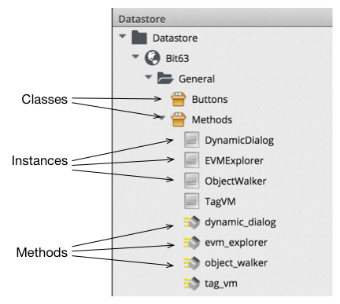

## Classes, Schemas and Instances

### Classes
A **class** contains a generic definition for a set of automation operations. Each class has a **schema**, that defines the variables, states, relationships or methods that **instances** of the class will use. A schema often has just one entry - to run a single **method** - but in many cases it has several components, e.g.

### Schemas
A schema is made up of a number of elements, or _fields_, and each field is added or edited in the schema editor by specifying the field _Type_ from a drop-down list ...

...and the field _Data Type_ from a drop-down list:

We can define defaut values for fields in a class schema, which can be optionally over-ridden in the schemas of any instances created from the class.

### Instances

An **instance** is a specific "clone" of the generic class, with actual values of the schema attributes filled in.
