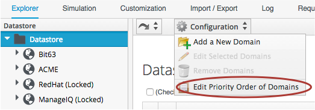

## Domains and Namespaces

### Domains
A **Domain** is a collection of **Namespaces**, **Classes**, **Instances** and **Methods**. The ManageIQ upstream project provides a single _ManageIQ_ Domain for all supplied automation code, while Red Hat adds the supplemental _RedHat_ Domain containing added-value code for the CloudForms product.
<br> <br>


<br>
Both the ManageIQ and RedHat Domains are locked, indicating their read-only nature, however we are free to create our own Domains for our custom automation code. Organising our own code into custom Domains greatly simplifies the task of exporting and importing code (simplifying code portability and re-use), and leaves ManageIQ/Red Hat free to update the locked Domains through minor releases without fear of overwriting our customisations.

#### Domain Priority
User-added Domains can be individually enabled or disabled, and all Domains can be layered in a priority order such that if code exists in the same path in multiple Domains (for example /Infrastructure/VM/Provisioning/StateMachines/Methods), the code in the highest priority enabled Domain will be executed.
<br> <br>




#### Importing / Exporting Domains
Domains can be exported using _rake_ from the command line, and imported either using _rake_ or from the WebUI. (Using rake enables us to specify more import and export options). A typical rake import line is...

```
script/rails runner script/rake evm:automate:import YAML_FILE=Buttons.yaml IMPORT_AS=Bit63 SYSTEM=false ENABLED=true DOMAIN=Export PREVIEW=false
```

See the following kbase articles for details and examples of importing and exporting Domains using rake:

[Cloudforms 3.1 Exporting Automate Domains](https://access.redhat.com/solutions/1225313)
[Cloudforms 3.1 Importing Automate Domains](https://access.redhat.com/solutions/1225383)

#### Copying Objects Between Domains

We frequently need to customise code in the locked RedHat or ManageIQ Domains, for example when implementing our own VM Placement method. Fortunately we can easily copy any object from the locked Domains into our own using Configuration -> Copy this ...
<br> <br>


<br>
Domains are a new feature of the Automation engine for the ManageIQ _Anand_ release (CloudForms 3.1). Prior to this release all factory-supplied and user-created automation code was contained in a common structure, which made updates difficult when any user-added code was introduced (the user-supplied modifications needed exporting and re-importing/merging whenever an automation update was released).

###Namespaces
A **Namespace** is a folder-like container for **Classes**, **Instances** and **Methods**, and is purely used for organisational purposes.


We create Namespaces (nested if required) to arrange our code logically.
