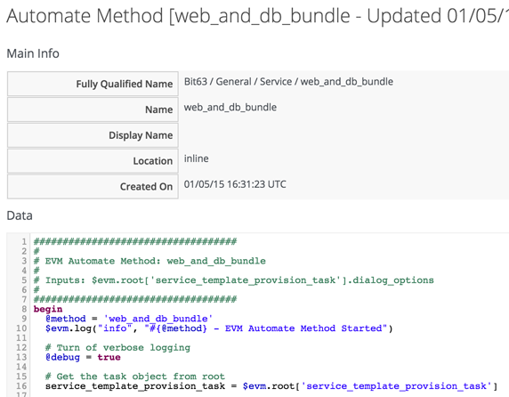

## Methods

### Methods

A **method** is a self-contained block of Ruby code. This is the stuff that we write, as well as the code that comes supplied out-of-the-box.

Methods can have one of three _Location_ values: _inline_, _builtin_, or _URI_. In practice most of the methiods that we create are _inline_.

