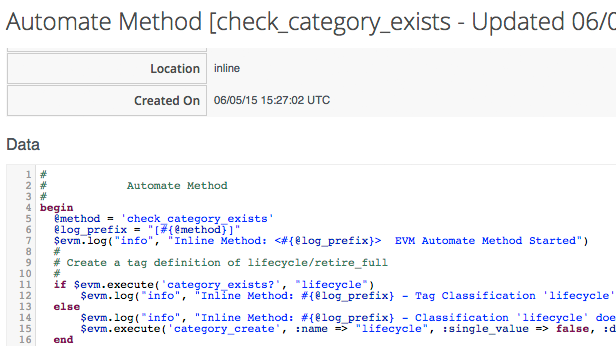

## Methods

### Methods

A _Method_ is a self-contained block of Ruby code. This is the code that gets executed when we run any Automation operation.
   

 
Methods can have one of three _Location_ values: _inline_, _builtin_, or _URI_. In practice most of the methods that we create are _inline_ methods.

