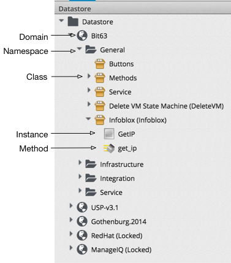

## Introduction to the Automation Datastore

The automation Datastore has a directory-like structure, consisting of several types of object:

We can look at each of these types of object in more detail.
