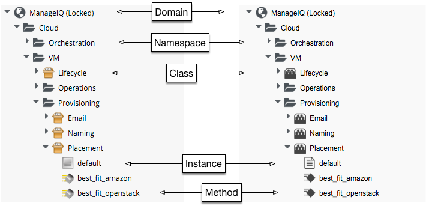

## Introduction to the Automation Datastore

Before we start investigating CloudForms/ManageIQ Automation in detail, it's worth taking a tour of the Automation Datastore, to familiarise ourselves with the objects that we'll find there.

### The Automation Datastore

The Automation Datastore has a directory-like structure, consisting of several types of object. The screenshot below shows the icon styles for CloudForms Management Engine 5.4 (left) and CloudForms Management Engine 5.5 (right) 
   

 

 
We can look at each of these types of object in more detail in the following sections.
