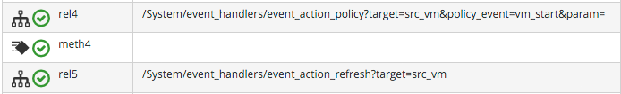

## Catching and Handling External Events

External (Provider) events are monitored by _EventCatcher_ workers, which monitor the real-time message or event busses on the various Providers - AWS:config for Amazon, AMQP/RabbitMQ for OpenStack, the native VMware Message Bus, or the RHEV-M events exposed through the RESTful API for example.

From `evm.log` on ManageIQ _Botvinnik_ (CloudForms Management Engine 5.4) we can see:

```
MIQ(EventCatcherOpenstack) EMS [rhosp-cont] as [admin] Caught event [compute.instance.power_on.start]
MIQ(EventCatcherOpenstack) EMS [rhosp-cont] as [admin] Caught event [compute.instance.power_on.end]
MIQ(EventCatcherRedhat) EMS [rhevm01] as [admin@internal] Caught event [USER_STARTED_VM]
MIQ(EventCatcherRedhat) EMS [rhevm01] as [admin@internal] Caught event [USER_RUN_VM]
```

With ManageIQ _Capablanca_ (CloudForms Management Engine 5.5) the EventCatcher workers have been renamed in accordance with the new Provider namespace format, so entries in `evm.log` appear as:

```
MIQ(ManageIQ::Providers::Redhat::InfraManager::EventCatcher::Runner#process_event) \
	EMS [rhevm01] as [admin@internal] Caught event [USER_INITIATED_SHUTDOWN_VM]
MIQ(ManageIQ::Providers::Redhat::InfraManager::EventCatcher::Runner#process_event) \
 	EMS [rhevm01] as [admin@internal] Caught event [VM_DOWN]
MIQ(ManageIQ::Providers::Openstack::CloudManager::EventCatcher::Runner#process_event) \
 	EMS [rhosp-cont] as [admin] Caught event [compute.instance.power_on.start]
```

### Event Processing

The EventCatcher workers queue the handling and processing of the specific event to one or more _EventHandler_ workers. The arguments passed to the EventHandler include the Provider-specific details for the event source. In this example a RHEV **USER\_RUN\_VM** event is being processed, and we see the RHEV API id's and href's describing the event source.

```
Args: [{:id=>"26790",
        :href=>"/api/events/26790",
        :cluster=>{:id=>"00000001-0001-0001-0001-000000000249",
                   :href=>"/api/clusters/00000001-0001-0001-0001-000000000249"},
        :data_center=>{:id=>"00000002-0002-0002-0002-000000000314",
                       :href=>"/api/datacenters/00000002-0002-0002-0002-000000000314"},
        :host=>{:id=>"b959325b-c667-4e3a-a52e-fd936c225a1a",
                :href=>"/api/hosts/b959325b-c667-4e3a-a52e-fd936c225a1a"},
        :user=>{:id=>"fdfc627c-d875-11e0-90f0-83df133b58cc",
                :href=>"/api/users/fdfc627c-d875-11e0-90f0-83df133b58cc"},
        :vm=>{:id=>"4e7b66b7-080d-4593-b670-3d6259e47a0f",
              :href=>"/api/vms/4e7b66b7-080d-4593-b670-3d6259e47a0f"},
        :description=>"VM rhel7srv010 started on Host rhelh03.bit63.net",
        :severity=>"normal",
        :code=>32,
        :time=>2016-01-31 15:53:29 UTC,
        :name=>"USER_RUN_VM"}]
```
In _Capablanca_ the EventHandler workers feed the handling of the event into the ([Event Switchboard](./event_switchboard.md)), by queuing a request to Automate. The EventHandlers translate the Provider-specific arguments (API href's) into CloudForms/ManageIQ object IDs, and include these as arguments to the Automate request:

```
Args: [{:object_type=>"EmsEvent",
        :object_id=>1000000007999,
        :attrs=>{:event_id=>1000000007999,
                 :event_stream_id=>1000000007999,
                 :event_type=>"USER_RUN_VM",
                 "VmOrTemplate::vm"=>1000000000023,
                 :vm_id=>1000000000023,
                 "Host::host"=>1000000000002,
                 :host_id=>1000000000002},
                 :instance_name=>"Event",
                 :user_id=>1000000000001,
                 :miq_group_id=>1000000000002,
                 :tenant_id=>1000000000001,
                 :automate_message=>nil}]
```

The request is de-queued and passed to the Automation Engine, which instantiates the `/System/Process/Event` entry point to the Event Switchboard, along with the arguments passed by the EventHandler:

```
<AutomationEngine> Instantiating [/System/Process/Event?
                                  EventStream%3A%3Aevent_stream=1000000007999&
                                  Host%3A%3Ahost=1000000000002&
                                  MiqServer%3A%3Amiq_server=1000000000001&
                                  User%3A%3Auser=1000000000001&
                                  VmOrTemplate%3A%3Avm=1000000000023&
                                  event_id=1000000007999&
                                  event_stream_id=1000000007999&
                                  event_type=USER_RUN_VM&
                                  host_id=1000000000002&
                                  object_name=Event&
                                  vm_id=1000000000023&
                                  vmdb_object_type=event_stream]
```
In the case of our RHEV **USER\_RUN\_VM** event, the Event Switchboard will direct the processing to the `/System/Event/EmsEvent/RHEVM/USER_RUN_VM` Instance, which contains Relationships to two Automation event\_handler Instances:
<br> <br>



We see that the **rel4** Relationship of this Instance calls `/System/event_handlers/event_action_policy` to initiate the creation of an internal generic _vm\_start_ event. This _vm\_start_ event is used when evaluating Control Policies and Alerts.