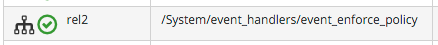
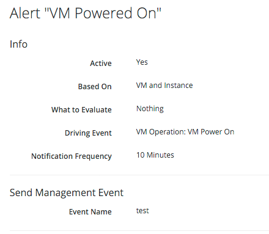

## Creating and Processing Internal Events

In addition to catching external events, CloudForms/ManageIQ can raise its own events that can be processed by Control Policies or Alerts. These are generated and handled by two internal (non-Automate) methods, `build_evm_event` and `process_evm_event`.

If we continue examining the processing of the RHEV **USER\_RUN\_VM** event, we see that the **rel4** Relationship  of the `/System/Event/EmsEvent/RHEVM/USER_RUN_VM` Instance initiates the creation of a generic _vm\_start_ event:

```
/System/event_handlers/event_action_policy? /
   target=src_vm& \
   policy_event=vm_start& \
   param=
```
We find that most of the Provider-specific events (such as **USER\_RUN\_VM** for RHEV or **compute.instance.power_off.end** for OpenStack) are re-raised as their generic equivalent event (such as **vm\_start**).

We can follow the processing from this point by examining `evm.log`.

```
<AutomationEngine> Invoking [builtin] method [/ManageIQ/System/event_handlers/event_action_policy] \
      with inputs [{"target"=>"src_vm", "policy_event"=>"vm_start", "param"=>""}]
```
We see the `build_evm_event` method assemble the parameters for the creation of the new _vm\_start_ event:


```

<AutomationEngine> MiqAeEvent.build_evm_event >> event=<"vm_start">
                          inputs=<{:"manageiq::providers::redhat::inframanager::vm"=>
                                     #<ManageIQ::Providers::Redhat::InfraManager::Vm
                                     id: 1000000000023,
                                     ...>,
                                   :ext_management_systems=>
                                     #<ManageIQ::Providers::Redhat::InfraManager
                                     id: 1000000000001,
                                     ...>,
                                   :ems_event=>
                                     #<EmsEvent
                                     id: 1000000007999,
                                     event_type: "USER_RUN_VM",
                                     message: "VM rhel7srv010 started on Host rhelh03.bit63.net",
                                     ...>,
                                   "MiqEvent::miq_event"=>1000000008000,
                                   :miq_event_id=>1000000008000,
                                   "EventStream::event_stream"=>1000000008000,
                                   :event_stream_id=>1000000008000}>
```
The new event is queued for processing by the Automation Engine (much of the work of the Automate Engine involves queueing and de-queuing further Automate work tasks):

```

MIQ(MiqAeEngine.deliver) Delivering {:event_type=>"vm_start",
                                     :"manageiq::providers::redhat::inframanager::vm"=>
                                     #<ManageIQ::Providers::Redhat::InfraManager::Vm 
                                    ...
                                     :event_stream_id=>1000000008000} for object \
                                        [ManageIQ::Providers::Redhat::InfraManager::Vm.1000000000023] \
                                        with state [] to Automate
```
The Automation Engine de-queues the task, and instantiates the `/System/Process/Event` entry point into the Event Switchboard, along with the arguments assembled and passed by the `build_evm_event` Method:

```

<AutomationEngine> Instantiating [/System/Process/Event?
                             EventStream%3A%3Aevent_stream=1000000008000&
                             MiqEvent%3A%3Amiq_event=1000000008000&
                             MiqServer%3A%3Amiq_server=1000000000001&
                             User%3A%3Auser=1000000000001&
                             VmOrTemplate%3A%3Avm=1000000000023&
                             ems_event=1000000007999&
                             event_stream_id=1000000008000&
                             event_type=vm_start&
                             ext_management_systems=1000000000001&
                             manageiq%3A%3Aproviders%3A%3Aredhat%3A%3Ainframanager%3A%3Avm=1000000000023&
                             miq_event_id=1000000008000&
                             object_name=Event&
                             vmdb_object_type=vm]

```
The Event Switchboard directs the processing to the `/System/Event/MiqEvent/POLICY/vm_start` Instance, which does not exist by default (we could create one if we wish). The `/System/Event/MiqEvent/POLICY/.missing` Instance is run in its place:

```
<AutomationEngine> Following Relationship [miqaedb:/System/Event/MiqEvent/POLICY/vm_start#create]

<AutomationEngine> Instance [/ManageIQ/System/Event/MiqEvent/POLICY/vm_start] \
    not found in MiqAeDatastore - trying [.missing]
```
The `.missing` Instance contains a **rel2** Relationship to `/System/event_handlers/event_enforce_policy`:



```
<AutomationEngine> Invoking [builtin] method [/ManageIQ/System/event_handlers/ \
    event_enforce_policy] with inputs [{}]
```
The `event_enforce_policy` Method initiates the processing of any Control Policies and Alerts that may be associated with the event being handled.

### Event-Initiated Control Policy Processing

The `/System/event_handlers/event_enforce_policy` method calls `process_evm_event` with a **target** argument corresponding to the VM object that raised the event:

```
MIQ(MiqEvent#process_evm_event) \
    target = [#<ManageIQ::Providers::Redhat::InfraManager::Vm id: 1000000000023, ...>]
```
The `process_evm_event` method raises the **vm\_start** (**VM Power On**) Policy Event, and processes any actions (i.e. Control Policies) associated with the triggering of this Policy Event:

```
MIQ(MiqEvent#process_evm_event) Event Raised [vm_start]
```
In our case we have a VM Control Policy that runs an **Invoke a Custom Automation** action when the **VM Power On** Event is triggered. The Custom Automation Instance runs `/Stuff/Methods/ObjectWalker` (via `/System/Request/Call_Instance`):
<br> <br>


The Automation Request to run `Call_Instance` is queued for processing by the Automation Engine. This is subsequently de-queued and delivered to Automate:

```
MIQ(MiqAeEngine.deliver) Delivering {"namespace"=>"stuff",
                                     "class"=>"methods",
                                     "instance"=>"objectwalker",
                                     :request=>"call_instance",
                                     "MiqPolicy::miq_policy"=>1000000000001} \
                              for object [VmOrTemplate.1000000000023] with state [] to Automate
```
### Alert Processing

The `process_evm_event` method now raises the **vm\_start** (**VM Operation: VM Power On**) Alert, and processes any actions associated with the triggering of this Alert:

```
MIQ(MiqEvent#process_evm_event) Alert for Event [vm_start]
```
In our case we have an Alert that sends a **Management Event** called _test_ when the **VM Operation: VM Power On** Alert is triggered:
<br> <br>



```
MIQ(MiqAlert.evaluate_alerts) [vm_start] Target: \
	ManageIQ::Providers::Redhat::InfraManager::Vm Name: [rhel7srv010], \
	Id: [1000000000023] Queuing evaluation of Alert: [VM Powered On]

```

### Event-Initiated Automation Request Workflows

Automation Engine workflows that involve a separated Requests and Tasks also uses raised events to control the processing sequence: 

```
MIQ(MiqProvisionRequest.call_automate_event) Raising event [request_created] to Automate
MIQ(MiqProvisionRequest.call_automate_event) Raising event [request_approved] to Automate
MIQ(MiqProvisionRequest.call_automate_event) Raising event [request_starting] to Automate
```

The next section ([Event-Driven Automation](./event_driven_automation.md)) takes a detailed look at this workflow for a REST-initiated Automation Request.

