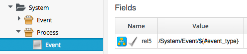
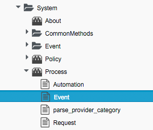
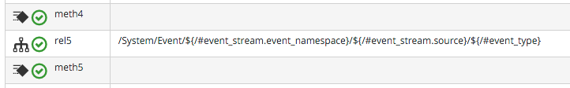

## Event-Driven Automation

Much of the logic flow through the Automation Engine is event-driven, using `/System/Process/Event` as the starting Instance in the logic chain. We can follow the sequence of events using automation.log, and the helpful "Following .. Followed" messages that the Engine prints.

In the following example an Automation Request has been submitted through the RESTful API to run a simple `/Discovery/Methods/Test` Instance.

### Event: request_created

The first messages that we see in the log notify us of the _request\_created_ event happening. On ManageIQ _Botvinnik_ (CloudForms Management Engine 5.4) we see:

```
MiqAeEvent.build_evm_event >> event=<"request_created"> inputs=<{}>
Instantiating [/System/Process/Event? \
	AutomationRequest%3A%3Aautomation_request=2000000000004& \
	MiqRequest%3A%3Amiq_request=2000000000004& \
	MiqServer%3A%3Amiq_server=2000000000001& \
	event_type=request_created& \
	object_name=Event& \
	vmdb_object_type=automation_request]
```
On ManageIQ _Capablanca_ (CloudForms Management Engine 5.5) we see the new event stream information added to the event:

```
MIQ(AutomationRequest#call_automate_event) \
    Raising event [request_created] to Automate
MiqAeEvent.build_evm_event >> event=<"request_created"> \
    inputs=<{"EventStream::event_stream"=>1000000009327, \
    :event_stream_id=>1000000009327}>
MIQ(AutomationRequest#call_automate_event) \
    Raised  event [request_created] to Automate
Instantiating [/System/Process/Event? \
    AutomationRequest%3A%3Aautomation_request=1000000000029& \
    EventStream%3A%3Aevent_stream=1000000009340& \
    MiqRequest%3A%3Amiq_request=1000000000029& \
    MiqServer%3A%3Amiq_server=1000000000001& \
    User%3A3Auser=1000000000001& \
    event_stream_id=1000000009340& \
    event_type=request_created& \
    object_name=Event& \
    vmdb_object_type=automation_request]
```

Here we see the event being triggered, which takes us into the standard `/System/Process/Event` entry point Instance. For ManageIQ _Botvinnik_ this is a simple variable substitution:
<br> <br>


For ManageIQ _Capablanca_ this contains a Relationship into the Event Switchboard:
<br> <br>




The variable substitution is made, and we follow the chain through the Switchboard:

```
Following Relationship [miqaedb:/System/Event/RequestEvent/Request/request_created#create]
```
<br>


<br>
For both _Botvinnik_ and _Capablanca_ the path though `/System/Event` ends with a Relationship that takes us to `/System/Policy/request_created`, so we follow the chain. The remainder of the processing for the _request\_created_ event is common to both _Botvinnik_ and _Capablanca_.

```
Following Relationship [miqaedb:/System/Policy/request_created#create]
```

<br>

<br>

This Instance runs `get_request_type` to find out what type of automation request has been initiated:

```
Invoking [inline] method [/ManageIQ/System/Policy/get_request_type] with inputs [{}]
<AEMethod [/ManageIQ/System/Policy/get_request_type]> Starting
<AEMethod get_request_type> Request Type:<AutomationRequest>
<AEMethod [/ManageIQ/System/Policy/get_request_type]> Ending
```

`get_request_type` returns "Request Type:\<AutomationRequest>"
<br> <br>
Next we follow the **rel4** relationship to `/System/Process/parse_provider_category`:

```
Following Relationship [miqaedb:/System/Process/parse_provider_category#create]
```
<br>


<br> <br>


```
Invoking [inline] method [/ManageIQ/System/Process/parse_provider_category] with inputs [{}]
<AEMethod [/ManageIQ/System/Process/parse_provider_category]> Starting
<AEMethod parse_provider_category> Parse Provider Category Key: nil  Value: unknown
<AEMethod [/ManageIQ/System/Process/parse_provider_category]> Ending
```

`parse_provider_category` returns _nil_ as this Automation Request does not involve any _Provider_ operations (as it would if we were provisioning a VM, for example).

Finally we follow the **rel5** relationship to `/System/Policy/AutomationRequest_created` ("AutomationRequest" having been substituted for ${#request\_type}). This doesn't exist (we can create one if we choose), so we see the warning message:

```
Instance [/ManageIQ/System/Policy/AutomationRequest_created] not found in MiqAeDatastore \
    - trying [.missing]
```

The `.missing` Instance does nothing, so we end that Event-initiated chain.

### Event: request_approved

The next event that we see is _request\_approved_, which follows a very similar chain of Relationships (we find that _request\_approved_ executes almost concurrently with _request\_created_ because we specified ```:auto_approve => true``` in the Automation Request API call). Here we see the extract from `evm.log` on _Capablanca_:

```
MIQ(AutomationRequest#call_automate_event) \
    Raising event [request_approved] to Automate
MiqAeEvent.build_evm_event >> event=<"request_approved"> \
    inputs=<{"EventStream::event_stream"=>1000000009436, 
    :event_stream_id=>1000000009436}>
MIQ(AutomationRequest#call_automate_event) \
    Raised  event [request_approved] to Automate
Instantiating [/System/Process/Event? \
    AutomationRequest%3A%3Aautomation_request=1000000000031& \
    EventStream%3A%3Aevent_stream=1000000009436& \
    MiqRequest%3A%3Amiq_request=1000000000031& \
    MiqServer%3A%3Amiq_server=1000000000001& \
    User%3A%3Auser=1000000000001& \
    event_stream_id=1000000009436& \
    event_type=request_approved& \
    object_name=Event& \
    vmdb_object_type=automation_request]
    
Following Relationship [miqaedb:/System/Event/RequestEvent/Request/request_approved#create]
  Following Relationship [miqaedb:/System/Policy/request_approved#create]
    Following Relationship [miqaedb:/System/Process/parse_provider_category#create]
      Invoking [inline] method [/ManageIQ/System/Process/parse_provider_category] with inputs [{}]
        <AEMethod [/ManageIQ/System/Process/parse_provider_category]> Starting
        <AEMethod parse_provider_category> Parse Provider Category Key: nil  Value: unknown
        <AEMethod [/ManageIQ/System/Process/parse_provider_category]> Ending
    Followed  Relationship [miqaedb:/System/Process/parse_provider_category#create]
    Following Relationship [miqaedb:/System/Policy/AutomationRequest_Approved#create]
      Instance [/ManageIQ/System/Policy/AutomationRequest_Approved] not found in MiqAeDatastore \ 
        - trying [.missing]
    Followed  Relationship [miqaedb:/System/Policy/AutomationRequest_Approved#create]
  Followed  Relationship [miqaedb:/System/Policy/request_approved#create]
Followed  Relationship [miqaedb:/System/Event/RequestEvent/Request/request_approved#create]
```

The _request\_approved_ event processing doesn't call `get_request_type`. Once again we have no `AutomationRequest_Approved` Method, so we terminate this Event-initiated chain at this point.

### Event: request_starting

The third event that we see is _request\_starting_. At this stage we're running within the context of an Automation Request; each of these log lines is preceeded by the text `Q-task_id([automation_request_1000000000031])`.

```
MIQ(AutomationRequest#call_automate_event_sync) \
    Raising event [request_starting] to Automate synchronously
MiqAeEvent.build_evm_event >> event=<"request_starting"> \
    inputs=<{"EventStream::event_stream"=>1000000009437, 
    :event_stream_id=>1000000009437}>

Instantiating [/System/Process/Event? \
    AutomationRequest%3A%3Aautomation_request=1000000000031& \
    EventStream%3A%3Aevent_stream=1000000009437& \
    MiqRequest%3A%3Amiq_request=1000000000031& \
    MiqServer%3A%3Amiq_server=1000000000001& \
    User%3A%3Auser=1000000000001& \
    event_stream_id=1000000009437& \
    event_type=request_starting& \
    object_name=Event& \
    vmdb_object_type=automation_request]

Following Relationship [miqaedb:/System/Event/RequestEvent/Request/request_starting#create]
  Following Relationship [miqaedb:/System/Policy/request_starting#create]
    Invoking [inline] method [/ManageIQ/System/Policy/get_request_type] with inputs [{}]
      <AEMethod [/ManageIQ/System/Policy/get_request_type]> Starting
      <AEMethod get_request_type> Request Type:<AutomationRequest>
      <AEMethod [/ManageIQ/System/Policy/get_request_type]> Ending
    Following Relationship [miqaedb:/System/Process/parse_provider_category#create]
      Invoking [inline] method [/ManageIQ/System/Process/parse_provider_category] with inputs [{}]
        <AEMethod [/ManageIQ/System/Process/parse_provider_category]> Starting
        <AEMethod parse_provider_category> Parse Provider Category Key: nil  Value: unknown
        <AEMethod [/ManageIQ/System/Process/parse_provider_category]> Ending
    Followed  Relationship [miqaedb:/System/Process/parse_provider_category#create]
    Following Relationship [miqaedb:/System/Policy/AutomationRequest_starting#create]
      Instance [/ManageIQ/System/Policy/AutomationRequest_starting] \
          not found in MiqAeDatastore - trying [.missing]
    Followed  Relationship [miqaedb:/System/Policy/AutomationRequest_starting#create]
  Followed  Relationship [miqaedb:/System/Policy/request_starting#create]
Followed  Relationship [miqaedb:/System/Event/RequestEvent/Request/request_starting#create]
MIQ(AutomationRequest#call_automate_event_sync) \
    Raised event [request_starting] to Automate
```

At the end of this chain we see the Automation Request queueing the Automation Task:

```
Q-task_id([automation_request_1000000000031]) \
    MIQ(AutomationTask#deliver_to_automate) Queuing Automation Request: [Automation Task]...
Q-task_id([automation_request_1000000000031]) \ 
    MIQ(AutomationTask#execute_queue) Queuing Automation Request: [Automation Task]...
```

### Task Processing

Finally we see the actual Task running. At this stage we're running within the context of an Automation Task; each of these log lines is preceeded by the text `Q-task_id([automation_task_1000000000034])`.

```
MIQ(AutomationTask#execute) Executing Automation Request request: [Automation Task]
MIQ(AutomationTask#execute) Automation Request initiated
Instantiating [/bit63/stuff/methods/test? \
    AutomationTask%3A%3Aautomation_task=1000000000034& \
    MiqServer%3A%3Amiq_server=1000000000001& \
    User%3A%3Auser=1000000000001& \
    object_name=test& \
    userid=admin& \
    vmdb_object_type=automation_task]
Invoking [inline] method [/Bit63/Stuff/Methods/test] with inputs [{}]
<AEMethod [/Bit63/Stuff/Methods/test]> Starting
<AEMethod test> This is a test!
<AEMethod [/Bit63/Stuff/Methods/test]> Ending
Method exited with rc=MIQ_OK
```


