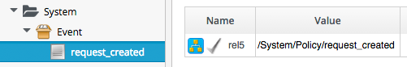
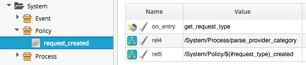

## Event-Driven Automation

Much of the logic flow through the Automation Engine is event-driven, using _/System/Process/Event_ as the starting Instance in the logic chain. We can follow the sequence of events using automation.log, and the helpful "Following .. Followed" messages that the Engine prints. In this case an Automation Request has been submitted through the RESTful API to run a simple _/Discovery/Methods/Test_ Instance.

### Event: request_created

The first messages that we see in the log notify us of the _request\_created_ event happening...

```
MiqAeEvent.build_evm_event >> event=<"request_created"> inputs=<{}>
Instantiating [/System/Process/Event?AutomationRequest%3A%3Aautomation_request=2000000000004&MiqRequest%3A%3Amiq_request=2000000000004&MiqServer%3A%3Amiq_server=2000000000001&event_type=request_created&object_name=Event&vmdb_object_type=automation_request]
```
Here we see the event being triggered, which takes us into the standard entry point Instance...


<br>


<br>
This is a relationship that takes us to _/System/Event/{#event\_type}_, and in our case _event\_type_ is _request\_created_, so we follow the chain...

```
Following Relationship [miqaedb:/System/Event/request_created#create]
```
<br>



<br>
This is a relationship that takes us to _/System/Policy/request\_created_, so we follow the chain...

```
Following Relationship [miqaedb:/System/Policy/request_created#create]
```
<br>



<br>

This Instance runs _get\_request\_type_ to find out what type of automation request has been initiated (notice that at this stage we're running withing the context of an _Automation Request_ (ID: 2000000000004))...

```
Q-task_id([automation_request_2000000000004]) <AEMethod [/ManageIQ/System/Policy/get_request_type]> Starting
Q-task_id([automation_request_2000000000004]) Invoking [inline] method [/ManageIQ/System/Policy/get_request_type] with inputs [{}]
Q-task_id([automation_request_2000000000004]) <AEMethod [/ManageIQ/System/Policy/get_request_type]> Starting
Q-task_id([automation_request_2000000000004]) <AEMethod get_request_type> Request Type:<AutomationRequest>
Q-task_id([automation_request_2000000000004]) <AEMethod [/ManageIQ/System/Policy/get_request_type]> Ending
Q-task_id([automation_request_2000000000004]) Method exited with rc=MIQ_OK
```

 

_get\_request\_type_ returns _Request Type:\<AutomationRequest\>_

Next we follow the _rel4_ relationship to _/System/Process/parse\_provider\_category_

```
Q-task_id([automation_request_2000000000004]) Following Relationship [miqaedb:/System/Process/parse_provider_category#create]
```


```
Q-task_id([automation_request_2000000000004]) Invoking [inline] method [/ManageIQ/System/Process/parse_provider_category] with inputs [{}]
Q-task_id([automation_request_2000000000004]) <AEMethod [/ManageIQ/System/Process/parse_provider_category]> Starting
Q-task_id([automation_request_2000000000004]) <AEMethod parse_provider_category> Parse Provider Category Key: nil  Value: unknown
Q-task_id([automation_request_2000000000004]) <AEMethod [/ManageIQ/System/Process/parse_provider_category]> Ending
Q-task_id([automation_request_2000000000004]) Method exited with rc=MIQ_OK
Q-task_id([automation_request_2000000000004]) Followed  Relationship [miqaedb:/System/Process/parse_provider_category#create]
```

_parse\_provider\_category_ returns _nil_ as this Automation Request does not involve any _Provider_ operations (as it would if we were provisioning a VM for example).

Finally we follow the _rel5_ relationship to _/System/Policy/AutomationRequest\_created_ ("AutomationRequest" having been substituted for ${#request\_type}). This doesn't exist (we can create one if we choose), so we see the warning message

```
Instance [/ManageIQ/System/Policy/AutomationRequest_created] not found in MiqAeDatastore - trying [.missing]
```

The .missing Instance does nothing, so we end that Event-initiated chain.

### Event: request_approved

The next event that we see is "request\_approved", which follows a very similar chain of references (actually _request\_approved_ executes almost concurrently with _request\_created_ because we specified ```:auto_approve => true``` in the Automation Request API call)...

```
MiqAeEvent.build_evm_event >> event=<"request_approved"> inputs=<{}>
Instantiating [/System/Process/Event?AutomationRequest%3A%3Aautomation_request=2000000000004&MiqRequest%3A%3Amiq_request=2000000000004&MiqServer%3A%3Amiq_server=2000000000001&event_type=request_approved&object_name=Event&vmdb_object_type=automation_request]
Following Relationship [miqaedb:/System/Event/request_approved#create]
Following Relationship [miqaedb:/System/Policy/request_approved#create]
Following Relationship [miqaedb:/System/Process/parse_provider_category#create]
Followed  Relationship [miqaedb:/System/Process/parse_provider_category#create]
Following Relationship [miqaedb:/System/Policy/AutomationRequest_Approved#create]
Instance [/ManageIQ/System/Policy/AutomationRequest_Approved] not found in MiqAeDatastore - trying [.missing]
Followed  Relationship [miqaedb:/System/Policy/AutomationRequest_Approved#create]
Followed  Relationship [miqaedb:/System/Policy/request_approved#create]
Followed  Relationship [miqaedb:/System/Event/request_approved#create]
```

Once again we have no _AutomationRequest\_Approved_ method, so we terminate this Event-initiated chain at this point.

### Event: request_starting

The third event that we see is _request\_starting_...

```
Q-task_id([automation_request_2000000000004]) MiqAeEvent.build_evm_event >> event=<"request_starting"> inputs=<{}>
Q-task_id([automation_request_2000000000004]) Instantiating [/System/Process/Event?AutomationRequest%3A%3Aautomation_request=2000000000004&MiqRequest%3A%3Amiq_request=2000000000004&MiqServer%3A%3Amiq_server=2000000000001&event_type=request_starting&object_name=Event&vmdb_object_type=automation_request]
Q-task_id([automation_request_2000000000004]) Following Relationship [miqaedb:/System/Event/request_starting#create]
Q-task_id([automation_request_2000000000004]) Following Relationship [miqaedb:/System/Policy/request_starting#create]
Q-task_id([automation_request_2000000000004]) Following Relationship [miqaedb:/System/Policy/AutomationRequest_starting#create]
Q-task_id([automation_request_2000000000004]) Instance [/ManageIQ/System/Policy/AutomationRequest_starting] not found in MiqAeDatastore - trying [.missing]
Q-task_id([automation_request_2000000000004]) Followed  Relationship [miqaedb:/System/Policy/AutomationRequest_starting#create]
Q-task_id([automation_request_2000000000004]) Followed  Relationship [miqaedb:/System/Policy/request_starting#create]
Q-task_id([automation_request_2000000000004]) Followed  Relationship [miqaedb:/System/Event/request_starting#create]
```

But at the end of this chain we see the Automation Request queueing the Automation Task...

```
Q-task_id([automation_request_2000000000004]) MIQ(AutomationTask.deliver_to_automate) Queuing Automation Request: [Automation Task]...
Q-task_id([automation_request_2000000000004]) MIQ(AutomationTask.execute_queue) Queuing Automation Request: [Automation Task]...
```

### Task Processing

Finally we see the actual Task running...

```
Q-task_id([automation_task_2000000000003]) Instantiating [/Bit63/Discovery/Methods/Test?AutomationTask%3A%3Aautomation_task=2000000000003&MiqServer%3A%3Amiq_server=2000000000001&User%3A%3Auser=2000000000001&object_name=Test&userid=admin&vmdb_object_type=automation_task]
Q-task_id([automation_task_2000000000003]) Invoking [inline] method [/Bit63/Discovery/Methods/test] with inputs [{}]
Q-task_id([automation_task_2000000000003]) <AEMethod [/Bit63/Discovery/Methods/test]> Starting
Q-task_id([automation_task_2000000000003]) <AEMethod test> Running test...
Q-task_id([automation_task_2000000000003]) <AEMethod [/Bit63/Discovery/Methods/test]> Ending
Q-task_id([automation_task_2000000000003]) Method exited with rc=MIQ_OK
```


