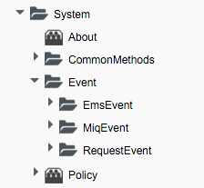
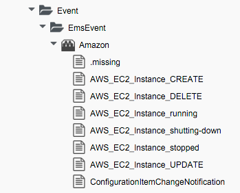
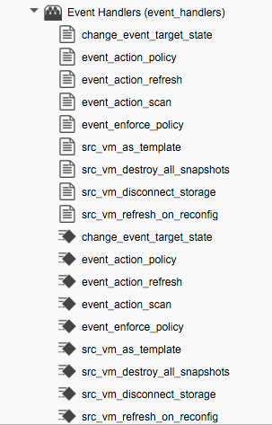

## The Event Switchboard

The way that CloudForms/ManageIQ handles events has changed with ManageIQ _Capablanca_. Prior to _Capablanca_ events entered Automation at `/System/Process/Event`, and were redirected to the appropriate Instance under the `/System/Event` Class based on the translation of the `#event_type` variable:
   

For example `#event_type` might translate to **request\_created**:
   

### The Event Stream

For _Capablanca_ (CloudForms Management Engine 5.5) event handling is expanded, and events are now handled as part of an _event stream_. The `/System/Process/Event` Class contains a new **rel5** Relationship that redirects the handling of the event into the _Event Switchboard_:

`/System/Event/${/#event_stream.event_namespace}/${/#event_stream.source}/${/#event_type}` 
   

### Switchboard Components Parts

The Relationship into the Switchboard is broken down into three parts, each selected from the substitution of a run-time variable.

#### Event Stream Namespace

The `${/#event_stream.event_namespace}` part of the Relationship translates to one of three _Event Stream Namespaces_: `EmsEvent` if the event's origin was from an _External Management System_ (i.e. a Provider); `MiqEvent` if the event's origin was an internal CloudForms/ManageIQ-initiated _Policy_ event; or `RequestEvent` if the event is related to an Automation Request (e.g. **request\_created**):
   

#### Event Stream Source

Within each of the Event Stream Namespaces, are Classes that define the _Event Stream Source_ Instances. The selection of source Class is made from the substitution of the `${/#event_stream.source}` part of the `/System/Process/Event` **rel5** Relationship. We can see that for the `EmsEvent` Namespace, these represent the various _External Management Systems_ (**Amazon**, **OpenStack**, etc.):
   

#### Event Type

Under the apprpriate Event Stream Source Classes are Instances that define the processing required for each _Event Type_. The selection of Event Type is made from the substitution of the `${/#event_type}` part of the `/System/Process/Event` **rel5** Relationship. We can see that these represent the various events that the **EventCatcher::Runner** workers detect from the Provider message bus, for example for the `Amazon` Namespace:
   

The Event Type Instances contain one or more Relationships to _Event Handlers_ in the `/System/event_handlers` Namespace that define what actions to take for that event. For example the **Amazon** event **AWS\_EC2\_Instance\_running** will call the `event_action_policy` handler to push a new **vm\_start** policy event through the Switchboard. It also calls the `event_action_refresh` handler to trigger a Provider refresh so that the current Instance details can be retrieved:
   

#### Event Handlers
The Event Handlers are Instances and Methods that perform the actual granular processing for each event. The Methods are _builtin_ for execution efficiency; their code is not visible in the Automate Explorer.
   

