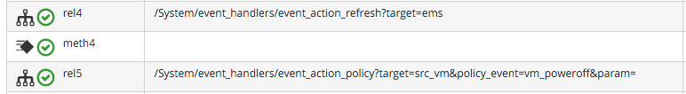
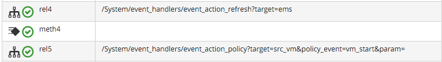

## Extending Automate Event Handling

The Provider-specific Event Stream Source Classes and associated Instances under `/System/Event/EmsEvent` do not necessarily handle every possible event that can be raised by the Provider. Sometimes we need to extend event handling to process a non-default event.

We can extend the out-of-the-box event handling by creating our own Instances under `/System/Event` (ManageIQ _Botvinnik_) or `/System/Event/EmsEvent/{Provider}` (ManageIQ _Capablanca_) to handle these non-default events caught by the EventCatcher workers.

As an example the _compute.instance.power\_on.end_ OpenStack event is not handled by default with ManageIQ _Capablanca_. If we look in `evm.log` we see:

```
Instance [/ManageIQ/System/Event/EmsEvent/OPENSTACK/compute.instance.power_on.end] \
    not found in MiqAeDatastore - trying [.missing]
```

As a result, the Cloud Instance's tile quadrant in the WebUI that shows power status doesn't change to reflect the Instance being powered on.

### Adding a New Automation Instance to /System/Event/EmsEvent/

There is already a `ManageIQ/System/Event/EmsEvent/OpenStack/compute.instance.power_off.end` Instance to handle the _compute.instance.power\_off.end_ event. This Instance calls two event\_handlers:




We can copy this Instance to our Domain and rename it as `/System/Event/EmsEvent/OpenStack/compute.instance.power_on.end`.
<br> <br>


We change the second event\_handler line to trigger a **vm_start** policy event:



Now when we power on an OpenStack Intance, we see the Instance's tile quadrant change correctly, and we see the raising and processing of the **vm_start** event:

```
Instantiating [/System/Process/Event? \
    EventStream%3A%3Aevent_stream=1000000009501&MiqEvent%3A%3Amiq_event=1000000009501& \
    MiqServer%3A%3Amiq_server=1000000000001& \
    User%3A%3Auser=1000000000001& \
    VmOrTemplate%3A%3Avm=1000000000035& \
    ems_event=1000000009500& \
    event_stream_id=1000000009501& \
    event_type=vm_start& \
    ext_management_systems=1000000000002& \
    manageiq%3A%3Aproviders%3A%3Aopenstack%3A%3Acloudmanager%3A%3Avm=1000000000035& \
    miq_event_id=1000000009501& \
    object_name=Event& \
    vmdb_object_type=vm]
```

This will ensure that any Control Policies that are triggered by a **VM Power On** Event will run correctly.