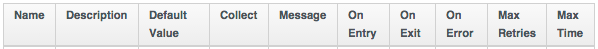
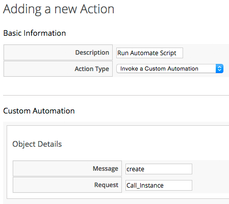

## State Machines

One of the types of Schema field is a **State**, and we can construct a Class Schema definition comprising a sequences of **States**. This then becomes a _State Machine_.

State Machines are a really useful way of performing a sequence of operations; they can ensure the successful completion of a prior step before the next step is run, permit steps to be retried, and allow us to set a timeout value for the successful completion of the State.

If we look at all of the attributes that we can add for a schema field, in addition to the familar **Name**, **Description**, and **Value** headings, we see a number of column headings that we haven't used so far:




### Schema Columns
The Schema columns for a State Machine are the same as in any other Class Schema, but we use more of them.

#### Value (Instance)/Default Value (Schema)
As in any other Class Schema, this is a Relationship to an _Instance_ to be run to perform the main processing of the State. 

#### On Entry
We can optionally define an **On Entry** _Method_ to be run before the "main" method (the **Value** entry) is run. We can use this to setup or test for pre-conditions to the State, for example if the "main" Method adds a tag to an object, the **On Entry** method might check that the category and tag exist.

The Method name can be specified as a relative path to the local class (i.e. just the Method name), or in Namespace/Class/Method syntax.

Note - some State Machines use an **On Entry** _Method_ instead of a **Value** _Relationship_ to perform the main work of the State. This is useful when we wish to create self-contained State Machines with the State Machine Instance and its associated Methods all in one class.

#### On Exit
We can optionally define an **On Exit** _Method_ to be run if the "main" Method (the **Value** Relationship/Instance or **On Entry** Method) returns `$evm.root['ae_result'] = 'ok'`

#### On Error
We can optionally define an **On Error** _Method_ to be run if the "main" Method (the **Value** Relationship/Instance or **On Entry** Method) returns `$evm.root['ae_result'] = 'error'`

#### Max Retries
We can optionally define a maximum number of retries that the Stage/State is allowed to attempt. Defining this in the State rather than the Method itself simplifies the Method coding, and makes it easier to write generic Methods that can be re-used in a number of State Machines.

#### Max Time
We can optionally define a maximum time (in seconds) that the State will be permitted to run for, before being terminated.

#### State Machine Example
We can look at the out-of-the-box `/Infrastructure/VM/Provisoning/StateMachines/ProvisionRequestApproval/Default` State Machine Instance as an example, and see that it defines an attribute **max_vms**, and has just two Stages/States; **ValidateRequest** and **ApproveRequest**. 

There is no **Value** Relationship specified for either State/Stage; each of these States runs a locally defined Method (in the same `/Infrastructure/VM/Provisoning/StateMachines/ProvisionRequestApproval/` Class) to perform the state-related processing.

The greyed-out values for **on_entry** and **on_error** are defaults defined in the Class Schema rather than the Instance.
<br> <br>



### State Variables

#### $evm.root['ae\_result']

A Method run within the context of a State Machine can return a completion status back to the Automation Engine, which can then decide which next action to perform (such as whether to advance to the next State).

We do this by setting one of three values in the `ae_result` hash key:

```ruby
# Signal an error
$evm.root['ae_result'] = 'error'
$evm.root['ae_reason'] = "Failed to do something"

# Signal that the step should be retried after a time interval
$evm.root['ae_result']         = 'retry'
$evm.root['ae_retry_interval'] = '1.minute'

# Signal that the step completed successfully
$evm.root['ae_result'] = 'ok'
```

#### $evm.root['ae\_state\_retries']

We can find out whether we're in a step that's being retried by querying the ```ae_state_retries``` key:

```ruby
state_retries = $evm.root['ae_state_retries'] || 0
```

#### Getting the State Machine Name

We can find the name of the State Machine that we're running in:

```ruby
state_machine = $evm.current_object.class_name
```

#### Getting the Current Step in the State Machine

We can find out which step in the State Machine we're executing in (useful if we have a generic error handling method):

```
step = $evm.root['ae_state']
```

#### Getting the on\_entry, on\_exit, on\_error Stage Within the Current Step

```ruby
if $evm.root['ae_status_state'] == "on_entry"
  ...
```
### State Machine Workflow
We can look at the workflow through a ManageIQ _Botvinnik_ (CloudForms Management Engine 5.4) State Machine using the diagram in the official CloudForms Management Engine 5.4 _Lifecycle and Automation Guide_ (section 4.3. STATE MACHINES):


Here we see that any error condition caught by the **on_error** method results in an abort of the State Machine. 

#### State Machine Enhancements in ManageIQ Capablanca

Several useful additions to State Machine functionality were added with ManageIQ _Capablanca_ (CloudForms Management Engine 5.5)

##### Error Recovery

Rather than automatically aborting the State Machine, an **on_error** Method now has the capability to take recovery action from an error condition, and set `$evm.root['ae_result'] = 'continue'` to ensure that the State Machine continues.

##### Skipping States

To allow for intelligent **on_entry** pre-processing, and to advance if pre-conditions are already met, an **on_entry** Method can set `$evm.root['ae_result'] = 'skip'` to advance directly to the next State, without calling the current State's 'Value' method.

##### Jumping to a Specific State

Any of our State Machine Methods can set `$evm.root['ae_next_state'] = <state_name>` to allow the State Machine to advance forward several steps.

Note: setting `ae_next_state` only allows us to go forward in a state machine. If we want to go back to a previous state, we can restart the state machine, but set `ae_next_state` to the name of the state that we want to restart at. When issuing a restart, if `ae_next_state` is not specified the state machine will restart at the first state. 

```ruby
# Currently in state4
$evm.root['ae_result'] = 'restart' 
$evm.root['ae_next_state'] = 'state2'
```

### Saving Variables Between State Retries

When a step is retried in a State Machine, what actually happens is that the entire State Machine is re-instantiated, starting from the step to be retried. This can make life difficult if we want to store and retrieve variables between steps in a State Machine (something we frequently want to do). Fortunately there are three $evm methods that we can use to test the presence of, save, and read variables between re-instantiations of our State Machine:

```ruby
$evm.set_state_var(:server_name, "myserver")
if $evm.state_var_exist?(:server_name)
  server_name = $evm.get_state_var(:server_name)
end

```

We can save most types of variables, but because of the dRuby mechanics behind the scenes, we can't save hashes that have default initializers, e.g.

```ruby
my_hash=Hash.new { |h, k| h[k] = {} }
```

Here the `|h, k| h[k] = {}` is the initializer function. 