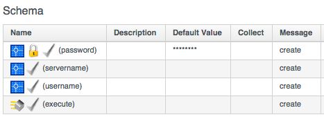
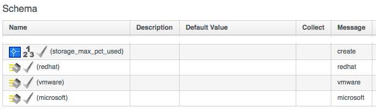
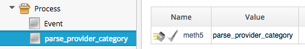
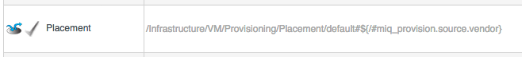
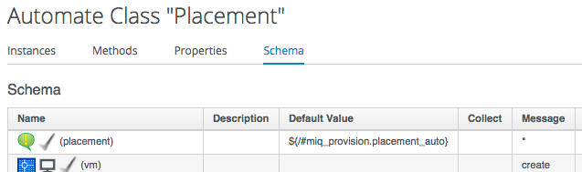
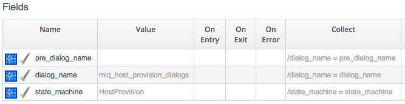

## More Advanced Class and Schema Concepts
There are three more Class/Schema concepts that we use with varying degrees of frequency.

### Messages
Each Schema Field has a **Message** column/value that we can optionally use to identify a particular Field to execute or evaluate when we call the Instance. We can think of this as an index key into the schema.

The default message is _create_, and if we look at the schema that we created for our _/ACME/General/Methods_ class, we see that the default Message value of _create_ was automatically set for us for all fields...
<br> <br>



<br>
We specify the Message when we create a Relationship to an Instance, by appending _#message_ after the URI to the Instance. If we don't explicitly specify a Message then _#create_ is implicitly used.

For example we could create a Relationship to run our first _HelloWorld_ Instance, using a URI of either

```
/ACME/General/Methods/HelloWorld
```

or

```
/ACME/General/Methods/HelloWorld#create
```

In both cases the _hello\_world_ Method would execute as this is the _Method_ schema field "indexed" by the _create_ message.

#### Specifying our own Messages
It can be useful to create a Class/Instance schema that allows for one of several Methods to be executed, depending on the Message passed to the Instance at run-time. For example the schema for the _Infrastructure/VM/Provisioning/Placement_ Class allows for a Provider-specific VM placement algorithm to be created...
<br> <br>



<br>
The _default_ Instance created from this Class has the Method values filled in accordingly...
<br> <br>



<br>
...which means that it can be called as part of the VM Provisioning State Machine, by appending a Message created from a variable substitution corresponding to the provisioning source vendor (i.e. redhat, vmware or microsoft)...

```
/Infrastructure/VM/Provisioning/Placement/default#${/#miq_provision.source.vendor}
```

<br> <br>
In this way we are able to create a generic Class and Instance definition that contains several Methods, and the choice of which Method to run can be selected dynamically at run-time by using a Message.

### Assertions
An **Assertion** is a boolean check that we can put (usually at the top) in our Class schema. If the Assertion evaluates to _true_ the remaining Instance schema fields are processed. If the Assertion evaluates to _false_ the remainder of the Instance fields are not processed.

An example of an Assertion is found at the start of the Schema for the _Placement_ Class. Placement methods are only relevant if the _Automatic_ check box has been selected at provisioning time, and this check box sets a boolean value _miq\_provision.placement\_auto_. The Assertion checks that this value is true, and prevents the remainder of the Instance from running if atimomatic placement has not been selected.




### Collect
As we have seen, there is a parent - child relationship between the $evm.root object (the one whose instantiation took us into the Automation Engine), and subsequent objects created as a result of following schema relationships or by calling $evm.instantiate.

If a child object has schema Attribute values, it can read or write to them by using its own $evm.object hash (e.g. we saw the use of ```$evm.object['username']``` in an earlier example). Sometimes we need to propagate these values back up the parent $evm.root object, and we do this using **Collections**.

We define a value to collect in the _Collect_ schema column, using the syntax ```/root_variable_name = schema_variable_name```, e.g.
<br> <br>



<br>

In this example schema, the child object has three schema attributes defined, _pre\_dialog\_name_, _dialog\_name_, and _state\_machine_.

If a local Method were to reference these it would use the syntax ```$evm.object['pre_dialog_name']```, ```$evm.object['dialog_name']``` or ```$evm.object['state_machine']```, however the **collect** value also makes these same Attribute values available to the root object as ```$evm.root['dialog_name']``` and ```$evm.root['state_machine']```.

Collections make it possible for root objects to spawn "worker" child Instances to discover various Attribute values, and to have these values propagated back to the root object to be used in "bigger picture" coordination and orchestration tasks.


