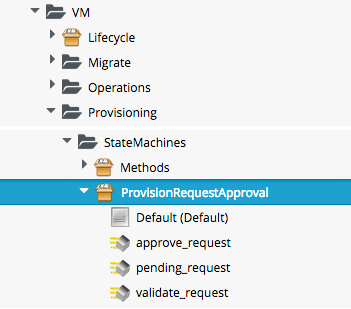
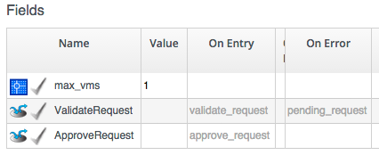
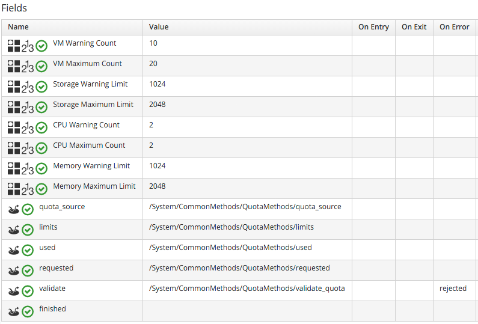

## Approval and Quota

### Approval

The approval process for a VM Provision Request is entered as a result of the _System/Policy/MiqProvisionRequest\_created_ policy being run from a _request\_created_ event. This results in a VM Provisioning Profile lookup to read the value of the _auto\_approval\_state\_machine_ attribute, which by default is _ProvisionRequestApproval_ for an Infrastructure VM Provision Request. The second relationship from the event runs the _Default_ Instance of this State Machine.
   

 
The Schema for the _ProvisionRequestApproval_ State Machine is:
   

 
The _Default_ Instance has the following Field values:
   

 

This Instance will auto-approve any VM Provisioning Request containing a single VM, but requests for more than this number will require explicit approval from an Administrator, or anyone in a Group with the role _EvmRole-approver_ (or equivalent).

We can copy the _Default_ Instance (including path) to our own Domain and change or set any of the auto-approval schema Attributes, i.e. _max\_cpus, max\_vms, max\_memory_ or _max\_retirement\_days_.

### Overriding the Schema Default - Template Tagging

We can override the auto-approval _max_\_* values stored in the _ProvisionRequestApproval_ State Machine on a per-Template basis, by applying tags from one or more of the following tag categories to the Template:
 

|  Tag Category Name  | Tag Category Display Name  |
|:----------:|:----------------:|
| prov\_max\_cpu | Auto Approve - Max CPU |
| prov\_max\_memory | Auto Approve - Max Memory |
| prov\_max\_retirement\_days | Auto Approve - Max Retirement Days |
| prov\_max\_vm | Auto Approve - Max VM |
 

If a Template is tagged in such a way, then any VM Provisioning Request _from_ that Template will result in the Template's tag value being used for auto-approval considerations, rather than the Attribute value from the schema.

### VM Provisioning-Related Email

There are four Email Instances with corresponding Methods that are used to handle the sending of VM Provisioning-related emails. The Instances each have the Attributes _to\_email\_address, from\_email\_address_ and _signature_ that can (and should) be customised, after copying the Instances to our own Domain.

Three of the Instances are approval-related. The _to\_email\_address_ value for the _MiqProvisionRequest\_Pending_ Instance should contain the email address of a user (or mailing list) who is able to login to the CloudForms appliance as an Administrator or as a member of a Group with the role _EvmRole-approver_ (or equivalent).
   

 

### Quota

The quota checking process for a VM Provision Request is entered as a result of the _MiqProvisionRequest\_starting_ event being triggered. This results in a Provisioning Profile lookup to read the value of the _get\_quota\_state\_machine_ attribute, which by default is _ProvisionRequestQuotaVerification_ for an Infrastructure VM Provision Request. The second relationship from the event runs the _Default_ Instance of this State Machine.

The Schema for the _ProvisionRequestQuotaVerification_ State Machine is:
   

 
The _Default_ Instance has the following Field values:
   

 

This Instance will validate any VM Provisioning Request, and so will not enforce any quotas.

We are free to copy the _Default_ Instance (including path) to our own Domain and change or set any of the quota limit schema Attributes, i.e. _max\_owner\_cpu, max\_owner\_memory, max\_owner\_storage_, or _max\_group\_cpu, max\_group\_memory, max\_group\_storage_. These quota settings will then apply to all Users and Groups.

### Overriding the Schema Default - User and Group Tagging

We can override the quota _max_\_* values stored in the _ProvisionRequestQuotaVerification_ State Machine on a per-User or per-Group basis, by applying tags from one or more of the following tag categories to the User or Group:
 

|  Tag Category Name  | Tag Category Display Name  |
|:----------:|:----------------:|
| quota\_max\_cpu | Quota - Max CPUs |
| quota\_max\_memory | Quota - Max  Memory |
| quota\_max\_storage | Quota - Max  Storage |

For example:
   

   
If a User or Group is tagged in such a way, then any VM Provisioning Request from the User or any Group member is matched against the currently allocated CPUs, memory or storage for the User or Group. If the Provisioning Request would result in the quota being exceeded, then the Request is rejected, and the requesting User is emailed using the _MiqProvisionRequest\_Denied_ email class.
