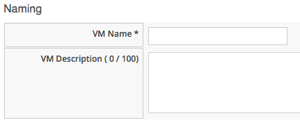
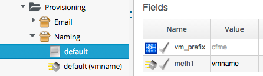

## VM Naming During Provisioning

CloudForms has a very flexible way of letting us assign names to VMs at provisioning time. It allows us to explicity name the VM (fine for single-VM provisioning operations), or to auto-append a zero-padded number for multi-VM provisioning requests.

It also allows us to use or create a custom naming policy whereby CloudForms auto-genererates VM names based on a number of factors, including a common prefix, tags, group membership, etc. (as we saw earlier, Naming is called as part of processing the Group Profile during provisioning, so different user groups can have entirely different VM naming schemes).

### VM Name-related Provisioning Options

The naming process has several inputs, and usually two outputs.

The _inputs_ to the naming process are a number of variables and symbols that are set (and we can customise) during the Provisioning Dialog, or defined in the Naming class schema. The _outputs_ from the naming process are the VM Name, and optionally the _hostname_ (i.e. fqdn first part) to be applied to the VM's operating system.


#### Inputs to the Naming Process...

The following variables and symbols are used as inputs to the VM naming logic...

**:vm\_name** - This is given the value from the _VM Name_ box in Provision Virtual Machines -> Catalog, i.e.
<br> <br>



This is added to the _Request_ Options Hash as...

```
miq_provision_request.options[:vm_name]
```
<br>
**vm\_prefix** - Can be used to build a custom VM name, and is read from the _vm\_prefix_ variable in the Naming Instance schema (the default is "cfme", but we are free to define our own)...
<br> <br>



...or we can set a value in...

```
miq_provision_request.options[:vm_prefix]
```
<br>
**:hostname** - This is given the value of the _Host Name_ box in Provision Virtual Machines -> Customize, i.e.
<br> <br>


This is added to the _Request_ Options Hash as...

```
miq_provision_request.options[:hostname]
```
<br>
**:linux\_host\_name** - If a VMware Customization Specification for Linux is used, this is the _specific name_ extracted from the template. CloudForms Naming uses this to set the operating system _hostname_.

This is added to the _Request_ Options Hash as...

```
miq_provision_request.options[:linux_host_name]
```

**:sysprep\_computer\_name** - If a VMware Customization Specification for Windows is used, this is the _specific name_ extracted from the template. CloudForms Naming uses this as input to a  the sysprep process to set the NetBIOS name.

This is added to the _Request_ Options Hash as...

```
miq_provision_request.options[:sysprep_computer_name]
```

**:miq\_force\_unique\_name** - This symbol is used internally when provisioning VMs from a Service Catalog. The _Task_ Options Hash key...

```
miq_provision.options[:miq_force_unique_name]
```

...is set to ```[true, 1]``` when the _Task_ is created that provisions the Catalog Item VM.
<br>

#### Outputs from the Naming Process...

The following symbols are derived by the VM Naming Method and added to the _Task_ Options Hash...

**:vm\_target\_name** - The VM Name

This is added to the _Task_ Options Hash as...

```
miq_provision.options[:vm_target_name]
```

**:vm\_target\_hostname** - VM $(hostname) assigned from the output of the VM naming logic (15 characters for Windows, 63 characters for Linux)

This is added to the _Task_ Options Hash as...

```
miq_provision.options[:vm_target_hostname]
```
### Name Processing

Much of the VM naming logic happens in the Rails code that is not exposed to the Automation Engine, but the code does call an Automation Engine Naming Method that we can use apply our own customisations. The Automation Engine Naming Method writes its suggested name into ```$evm.object['vmname']```, which is propagated back to the internal Rails method via a Collect. If the Automation Engine Naming Method suggests a name that should be numerically suffixed (e.g. "#{vm_name}$n{3}"), then the back-end Rails code will allocate the next free number in the sequence and form the VM name accordingly.


The default Automation Engine Naming Method (_/Infrastructure/VM/Provisioning/Naming/vmname_) is as follows...

```ruby
#
# Description: This is the default vmnaming method
# 1. If VM Name was not chosen during dialog processing then use vm_prefix
#    from dialog else use model and [:environment] tag to generate name
# 2. Else use VM name chosen in dialog
# 3. Then add 3 digit suffix to vm_name
# 4. Added support for dynamic service naming
#

$evm.log("info", "Detected vmdb_object_type:<#{$evm.root['vmdb_object_type']}>")

prov = $evm.root['miq_provision_request'] || $evm.root['miq_provision'] || $evm.root['miq_provision_request_template']

vm_name = prov.get_option(:vm_name).to_s.strip
number_of_vms_being_provisioned = prov.get_option(:number_of_vms)
diamethod = prov.get_option(:vm_prefix).to_s.strip

# If no VM name was chosen during dialog
if vm_name.blank? || vm_name == 'changeme'
  vm_prefix = nil
  vm_prefix ||= $evm.object['vm_prefix']
  $evm.log("info", "vm_name from dialog:<#{vm_name.inspect}> vm_prefix from dialog:<#{diamethod.inspect}> vm_prefix from model:<#{vm_prefix.inspect}>")

  # Get Provisioning Tags for VM Name
  tags = prov.get_tags
  $evm.log("info", "Provisioning Object Tags: #{tags.inspect}")

  # Set a Prefix for VM Naming
  if diamethod.blank?
    vm_name = vm_prefix
  else
    vm_name = diamethod
  end
  $evm.log("info", "VM Naming Prefix: <#{vm_name}>")

  # Check :environment tag
  env = tags[:environment]

  # If environment tag is not nil
  unless env.nil?
    $evm.log("info", "Environment Tag: <#{env}> detected")
    # Get the first 3 characters of the :environment tag
    env_first = env[0, 3]

    vm_name =  "#{vm_name}#{env_first}"
    $evm.log("info", "Updating VM Name: <#{vm_name}>")
  end
  derived_name = "#{vm_name}$n{3}"
else
  if number_of_vms_being_provisioned == 1
    derived_name = "#{vm_name}"
  else
    derived_name = "#{vm_name}$n{3}"
  end
end

$evm.object['vmname'] = derived_name
$evm.log("info", "VM Name: <#{derived_name}>")

```

We can start to assemble the rules that the VM Naming methods use to determine names...

#### Provisioning a Single Server

Provisioning a single server from either Infrastructure -> Virtual Machines -> Lifecycle -> Provision VMs or from a Service Catalog will result in the VM being given the value of **:vm\_name**, unless **:vm\_name** is blank or has the value "changeme".
If **:vm\_name** is blank or "changeme" then we loop through the logic in the Automation Engine Naming Method, which assembles a VM name by combining the value of **:vm\_prefix** with the first 3 characters of the **:environment** tag (if it exists), and appending three zero-padded digits.

#### Provisioning Multiple Servers in a Single Request

Provisioning multiple servers from a Service Catalog will result in the symbol **:miq\_force\_unique\_name** being set to true for each _Task_. If **:vm\_name** is not blank or "changeme", then the servers will be named as **:vm\_name** with "_n{4}" appended, e.g. server\_0001, server\_0002, etc. according to the logic in the internal Rails class MiqProvision::Naming. In this scenario the Automation Engine Naming Method is not used.

Provisioning multiple servers from Infrastructure -> Virtual Machines -> Lifecycle -> Provision VMs will not result in **:miq\_force\_unique\_name** being set to true, and the VM naming logic in the Automation Engine Naming Method will apply; the servers will be given the value of **:vm\_name**, appended by three zero-padded digits, e.g. server001, server002, etc.

### Customising the Naming Process

We often wish to customise the naming process to our own requirements.

For example we might wish to have all servers named using a fixed prefix (**:vm_prefix**), followed by the value of the _server\_role_ tag, followed by a zero-padded digit extension. This can be done using a slight modification of the Automation Naming Method, in conjunction with tagging the servers that we wish to special-case...

```ruby
...
prefix = prov.get_option(:vm_prefix).to_s.strip
#
# Special case the any servers tagged with "server_role" - pemcg
#
# Get Provisioning Tags for VM Name
tags = prov.get_tags
#
# Check :server_role tag
#
server_role = tags[:server_role]
unless server_role.nil?
  derived_name = "#{prefix}#{server_role}$n{2}"
  $evm.object['vmname'] = derived_name
  $evm.log("info", "#{@method} - VM Name: <#{derived_name}>") if @debug
  #
  # Exit method
  #
  $evm.log("info", "#{@method} - EVM Automate Method Ended")
  exit MIQ_OK
end
#
# End of special case for servers tagged with "server_role"
#
...
```

We can do this by copying the _/Infrastructure/VM/Provisioning/Naming/default_ Instance and _/Infrastructure/VM/Provisioning/Naming/vmname_ Method into our own domain, and editing the schema or Method accordingly.

### VM Naming for Services (Directly Writing to the _Task_ Options Hash)

If we're working in the _Task_ context of the provisioning process (as we are when working in any of the ServiceProvision_Template State Machines for example), then the input variables to the Naming process, **:vm\_name**, **:vm\_prefix**, etc. are of no use to us. The Naming process has already been run; they will not be referenced again.

We are, however, free to directly update the **:vm\_target\_name** and **:vm\_target_hostname** values in the _Task_'s Options Hash at any point before the _Provision_ State of the VMProvision\_VM State Machine, i.e.

```ruby
task.set_option(:vm_target_name, "server001")
task.set_option(:vm_target_hostname, "server001")
```
