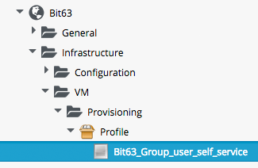
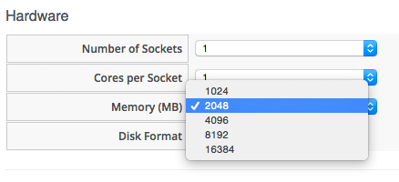

## The VM Provisioning Dialog

The VM Provisioning Dialog is presented to the user in the WebUI as part of the VM provisioning process. The dialog contains a number of tabs (**Request**, **Purpose**, **Catalog**, **Environment**, etc.), and a number of dialogs and input fields per tab:
<br> <br>


<br>
The Provisioning Dialog is context-sensitive, so a different set of dialog options will be displayed when provisioning into VMware or OpenStack, for example.

Each Provisioning Dialog is formatted from a large (900 line+) YAML file, specifying the main tabs, dialogs and fields to be displayed., e.g.
<br> <br>

```
---
:buttons:
- :submit
- :cancel
:dialogs:
  :requester:
    :description: Request
    :fields:
      :owner_phone:
        :description: Phone
        :required: false
        :display: :hide
        :data_type: :string
...
      :owner_email:
        :description: E-Mail
        :required: true
        :display: :edit
        :data_type: :string
 ...
   :purpose:
    :description: Purpose
    :fields:
      :vm_tags:
        :required_method: :validate_tags
        :description: Tags
        :required: false
        :options:
          :include: []
...
        :display: :edit
        :required_tags: []
        :data_type: :integer
    :display: :hide
    :field_order:
 ...
 :dialog_order:
- :requester
- :purpose
```
<br>
Dialog tabs and fields can be hidden (`:display: :hide`), made visible (`:display: :show`) or editable (`:display: :edit`). They can also be made mandatory (`:required: true`).

### Selection of VM Provisioning Dialog

There are a number of VM Provisoning Dialogs supplied out-of-the-box with CloudForms/ManageIQ, each of which provides the context-sensitivity for the particular provisioning operation. They are found under the **Automate -> Customization** menu, in the **Provisioning Dialogs** accordion.
<br> <br>

|  Name   |   Description   |
|:-------:|:---------------:|
| miq\_provision\_amazon\_dialogs\_template | Sample Amazon Instance Provisioning Dialog |
| miq\_provision\_microsoft\_dialogs\_template | Sample Microsoft VM Provisioning Dialog |
| miq\_provision\_openstack\_dialogs\_template | Sample Openstack Instance Provisioning Dialog |
| miq\_provision\_redhat\_dialogs\_clone\_to\_vm | Sample RedHat VM Clone to VM Dialog |
| miq\_provision\_redhat\_dialogs\_template | Sample RedHat VM Provisioning Dialog |
| miq\_provision\_dialogs\_clone\_to\_template | Sample VM Clone to Template Dialog |
| miq\_provision\_dialogs\_clone\_to\_vm | Sample VM Clone to VM Dialog |
| miq\_provision\_dialogs\_pre\_sample | Sample VM Pre-Provisioning Dialog |
| miq\_provision\_dialogs | Sample VM Provisioning Dialog |
| miq\_provision\_dialogs\_template | Sample VM Provisioning Dialog (Template) |
| miq\_provision\_dialogs-user | Sample VM Provisioning Dialog for User |

<br>
The various dialogs contain values that are relevant to their target Provider type (Amazon, OpenStack, Microsoft, VMware or RedHat), and also to the operation type (clone from template, clone to template, or clone to vm).

The selection of VM Provisioning Dialog to display to a user depends on the **dialog\_name** Attribute in the Provisoning Group Profile. The default **dialog\_name** value for the `.missing` and `EvmGroup-super_administrator` Profiles is:
<br> <br>

```
${#dialog_name_prefix}_${/#dialog_input_request_type}
```
<br>
The two variables are substituted at run-time, and provide the context-sensitity. The **dialog\_name\_prefix** value is determined by the `vm_dialog_name_prefix` Method, which contains the lines:
<br> <br>

```ruby
dialog_name_prefix = "miq_provision_#{platform}_dialogs"
dialog_name_prefix = "miq_provision_dialogs" if platform == "vmware"
```

The **dialog\_input\_request\_type** value is translated by a Rails back-end method (`miq_request_workflow.rb`) to be the Instance name of the VM Provisioning State Machine that we are using, i.e `template`, `clone_to_vm` or `clone_to_template`.

So for a VM Provision Request from Template into a RHEV Provider, the **dialog\_name** value will be substituted as:

```
miq_provision_redhat_dialogs_template
```

### User Group-Specific Dialogs

We can set separate Provisioning Dialogs for individual User Groups if we wish. As an example the default **dialog\_name** value in the `EvmGroup-user_self_service` Profile is:
<br> <br>

```
${#dialog_name_prefix}-user
```
<br>
This presents a reduced set of tabs, dialogs and input fields to anyone from the **EvmGroup-user\_self\_service** group provisoning into VMware (the only group-specific out-of-the-box Dialog is the VMware-specific `miq_provision_dialogs-user` Dialog). The hidden tabs have been given default values, for example Automatic placement is set to `true` by default:

```
      :placement_auto:
        :values:
          false: 0
          true: 1
        :description: Choose Automatically
        :required: false
        :display: :edit
        :default: true
        :data_type: :boolean
```
<br>
We can create per-group Dialogs as we wish, customising the values that are hidden or set as default.

### Expanding the Dialog

In some cases it's useful to be able to expand the range of options presented by the Dialog. For example the standard Dialogs only allows us to specify VM memory as 1GB, 2GB or 4GB 
<br> <br>


<br>
These options come from the `:vm_memory` Dialog section:


```
      :vm_memory:
        :values:
          '2048': '2048'
          '4096': '4096'
          '1024': '1024'
        :description: Memory (MB)
        :required: false
        :display: :edit
        :default: '1024'
        :data_type: :string
```
<br>
We sometimes need to be able to provision larger VMs, but fortunately we can customise the Dialog to our own needs. If we identify the Dialog that is being used (in this example case it is `miq_provision_redhat_dialogs_template` as we're provisioning into RHEV using Native Clone), we can copy the Dialog to make it editable (we'll call the new version `bit63_miq_provision_redhat_dialogs_template`).

We then expand the `:vm_memory` section as to match our requirements:

```
      :vm_memory:
        :values:
          '1024': '1024'
          '2048': '2048'
          '4096': '4096'
          '8192': '8192'
          '16384': '16384'
        :description: Memory (MB)
        :required: false
        :display: :edit
        :default: '1024'
        :data_type: :string
```
<br>
Save the newly edited Profile.

Now we copy the `/Infrastructure/VM/Provisioning/Profile` Class into our own Domain (if it's not already there), and create a Profile Instance for the User Group that we wish to assign the new Dialog to:
<br> <br>



<br>
The **dialog\_name** field in the new Profile should contain the name of our new Dialog:
<br> <br>


<br>
Now if we login as a user who is a member of the **Bit63\_Group\_user\_self\_service** Group and provision a VM, we see the expanded range of memory options:
<br> <br>


