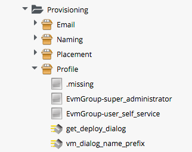

## The Provisioning Profile

Provisioning Profiles store the attributes, relationships and methods that are used to determine the User Group-specific operations and decisions that must be made whenever a VM is provisioned. These include the selection of the appropriate Provisioning Dialog, checking the provisioning request against user or group quotas, the triggering of an approval workflow for large VM requests, and the option to use group-specific VM naming and network allocation Methods.

### Location

The Provisioning Profiles are stored under _/Infrastructure/VM/Provisioning/Profile_. There are two out-of-the-box group-specific profiles for the _EvmGroup-super\_administrator_ and _EvmGroup-user\_self\_service_ groups, but we can create new profiles for any user groups that we wish to provision from. If a user who is not a member of a listed Group Profile provisions a VM, the _.missing_ Profile will be used.

###Schema

The Provisioning Profile schema contains a number of Attributes, Relationships and Methods, as shown:
 

 
Each of these is selected using a _Message_, and the Attributes are propagated up to $evm.root in the Provisioning operation using _Collect_, as follows:
   

### Customising the Profile

The Profile is designed to be user-customisable, and in fact we frequently add Profiles for specific user groups, or edit the _.missing_ profile to cater for updated VM Naming methods, or modified Provisioning Dialogs.

