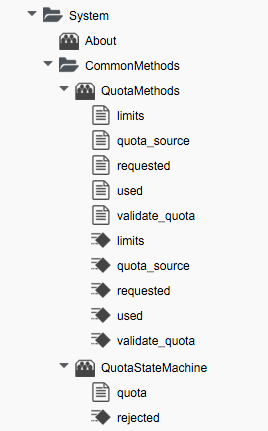
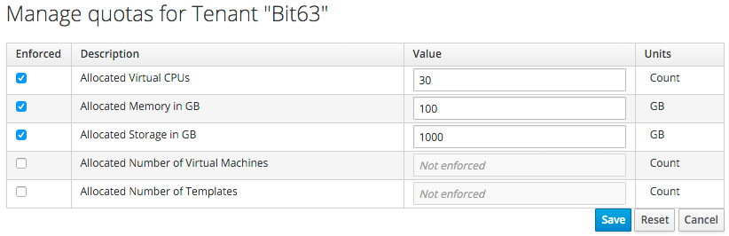
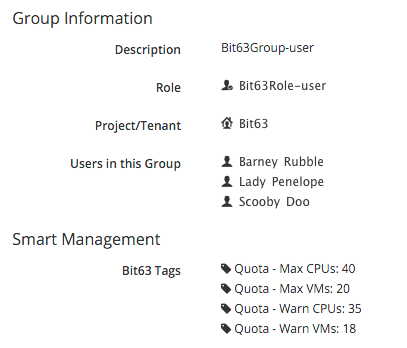
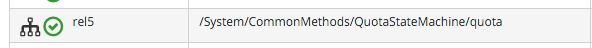

## Quota Management

Quota management has been completely re-written for ManageIQ _Capablanca_ (CloudForms Management Engine 5.5). Prior to this release, quota management for Cloud Instance, Infrastructure VM, and Service provisioning was handled under the respective `/Cloud`, `/Infrastructure`, and `/Service` Namespaces , but in _Capablanca_, quota handling has been consolidated under `/System/CommonMethods`:



The `ManageIQ/System/CommonMethods/QuotaStateMachine/quota` State Machine Instance has the following Field values:
<br> <br>

<br>

We can see that the processing of quota follows a simple workflow of:

1. Determine the quota source
2. Determine the quota limits assigned to that source
3. Determine the resources currently used by that source
4. Determine the new resources requested by the source
5. Validate whether the new requested amount would exceed quota

### Quota Source

A new concept with the re-implemented quota management mechanism is that of _quota source_. This is the entity to which the quota is applied, and by default is a Tenant. Tenant quotas can be edited in the WebUI under **Configure -> Configuration -> Access Control -> Tenants -> _tenant_**:



The tenant object keeps track of allocated values in virtual columns:

```
--- virtual columns follow ---
$evm.root['tenant'].allocated_memory = 48318382080   (type: Fixnum)
$evm.root['tenant'].allocated_storage = 498216206336   (type: Fixnum)
$evm.root['tenant'].allocated_vcpu = 23   (type: Fixnum)
$evm.root['tenant'].provisioned_storage = 546534588416   (type: Fixnum)
```

#### Alternative Quota Sources

If we wish to use an alternative quota source, we can copy the `quota_source` Method to our own domain, and edit it to define `$evm.root['quota_source']` and `$evm.root['quota_source_type']` as required. A commented-out example shows how to define a group as the quota source, in which case quota handling is handled in the pre-_Capablanca_ way: 


```ruby
# Sample code to enable group as the default quota source.
$evm.root['quota_source'] = @miq_request.requester.current_group
$evm.root['quota_source_type'] = 'group’
```

When we use an alternative quota source, we can set quota in two ways.

##### Defining Quota in the State Machine Schema (the Model)

We can set generic warn and max values for each of **VM Count**, **Storage**, **CPU** and **Memory**, by copying the `ManageIQ/System/CommonMethods/QuotaStateMachine/quota` State Machine Instance into our domain, and editing the schema attributes:


Quotas defined in the Model in this way apply to all instances of the quota source (e.g. all Groups)

##### Defining Quota Using Tags

We can override the default Model attributes by applying tags from one or more of the following tag categories to individual quota source entities (e.g. individual Groups):
<br>

|  Tag Category Name  | Tag Category Display Name  | Pre-Exists |
|:----------:|:----------------:|:--------------:|
| quota\_warn\_vms | Quota - Warn VMs | No - must be created |
| quota\_max\_vms | Quota - Max VMs | No - must be created |
| quota\_warn\_storage | Quota - Warn  Storage | No - must be created |
| quota\_max\_storage | Quota - Max  Storage | Yes |
| quota\_warn\_cpu | Quota - Warn CPUs | No - must be created |
| quota\_max\_cpu | Quota - Max CPUs | Yes |
| quota\_warn\_memory | Quota - Warn  Memory | No - must be created |
| quota\_max\_memory | Quota - Max  Memory | Yes |


For example:
<br> <br>

<br> <br>
If a Group is tagged in such a way, then any VM or Service Provisioning Request from any Group member is matched against the currently allocated CPUs, memory or storage for the Group.

If quotas are defined in both the Model and using tags, the tagged value takes priority.

### Quota Checking During VM Provisioning

The quota checking process for a VM Provision Request is entered as a result of the `/System/Policy/MiqProvisionRequest_starting` policy being run from a _request\_starting_ event. The policy Instance jumps straight to the `quota` State Machine from its **rel5** Relationship:
<br> <br>



If the Provisioning Request would result in the quota being exceeded, then the Request is rejected, and the requesting User is emailed using the `/{Infrastructure,Cloud}/VM/Provisioning/Email/MiqProvisionRequest_Denied`email class.