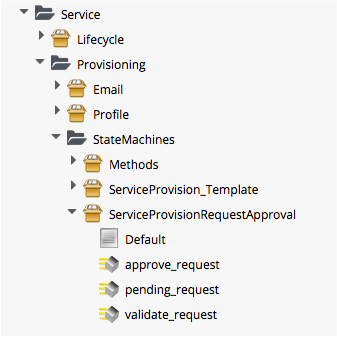
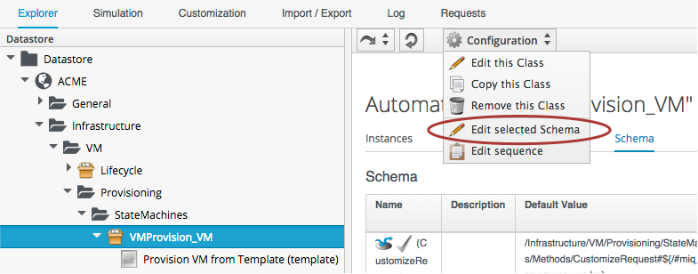
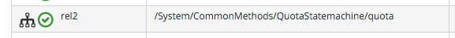

## Approval and Quota

### Approval

The approval process for a Service Provision Request is entered as a result of the `/ManageIQ/System/Policy/ServiceTemplateProvisionRequest_created` policy being run from a _request\_created_ event. This results in a Service Provisioning Profile lookup to read the value of the **auto\_approval\_state\_machine** attribute, which by default is `ServiceProvisionRequestApproval` for a Service Provision Request. The second relationship from the event runs the `Default` Instance of this State Machine.
   

 
The Schema for the `ServiceProvisionRequestApproval` State Machine is:
 

 
The `Default` Instance has the following Field values:
 

 

This Instance will auto-approve all Service Provisioning Requests.

### Quota

Quota checking for a Service Provision Request in ManageIQ _Capablanca_ (CloudForms Management Engine 5.5) uses the same consolidated quota mechanism as described in [Quota Management](../chapter15/quota_management.md).

The quota checking process is entered as a result of the `/System/Policy/ServiceTemplateProvisionRequest_starting` policy being run from a _request\_starting_ event. The policy Instance jumps straight to the `quota` State Machine from its **rel2** Relationship:
   

Currently the code does nothing if a quota is exceeded for a Service provision, but we can add 
a policy `/System/Policy/ServiceTemplateProvisionRequest_denied` to our own domain, that contains a Relationship to the `/Service/Provisioning/Email/ServiceTemplateProvisionRequest_Denied` email Instance in the `RedHat` Domain. Of course we should ideally copy this Email Instance into our own Domain as well so that we can customise the **from\_email\_addres**, **to\_email\_addres**, and **signature** attributes.
