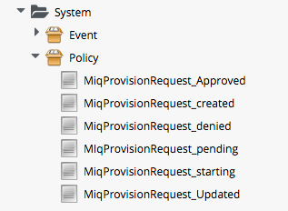

## Catalog{Item,Bundle}Initialization

Two of the out-of-the-box Service Provisioning State Machines are `CatalogItemInitialization` and `CatalogBundleInitialization`. They have been created to simplify the process of creating full-featured Service Catalog Items and Bundles, fronted by rich service dialogs, without the need for any Ruby scripting.

These two State Machine Instances, and their supporting Methods, have been completely re-written for ManageIQ _Botvinnik_ (CloudForms Management Engine 5.4). We will discuss the use of the `CatalogItemInitialization` Instance in detail in this section.

### CatalogItemInitialization

The `CatalogItemInitialization` State Machine can be specified when we create a Service Catalog _Item_, i.e. an orderable entry in the Service Catalog that provisions a single type of VM (although it may result in multiple VMs of the same type being provisioned).

The State Machine greatly simplifies the process of customising the provisioned VMs, using values read from the service dialog. It does this by setting options\_hash values or tags in the child and grandchild _miq\_request\_task_ objects, from specially constructed service dialog element names. It also allows us to specify a new unique name and description for the resulting Service.

The schema for the `CatalogItemInitialization` Instance is as follows:


<br>
We can see that the schema uses the **pre1** and **pre2** states to add a dialog parser (common between the `CatalogItemInitialization` and `CatalogBundleInitialization` State Machines), and the `CatalogItemInitialization` Method to set the child object options\_hash values and/or tags accordingly.

The `CatalogItemInitialization` Method itself relies on the dialog inputs having been parsed correctly by `dialog_parser`, and this requires us to use a 'standard' naming convention for our service dialog elements.

#### Service Dialog Element Naming Convention

To perform the service dialog -> options_hash or tag substitution correctly, we must name our service dialog elements in a particular way, depending on whether the element is requesting input for a single option or tag, or a comma-separated list (array) of options or tags.

##### Single Option

The simplest service dialog element to process is one that prompts for the value of a single options\_hash key. We name the service dialog element as:

**option\_0\__key\_name_** (for backwards compatibility with CloudForms Management Engine 5.3)

or just

**_key\_name_** (valid for CloudForms Management Engine 5.4 and later)

For example if we create a service dialog element as follows:



The resulting value input at run-time will be will be propagated to the child task's options hash as:

```
miq_request_task.options[:vm_memory]
```


The '0' in the  dialog name refers to the item sequence number when provisioning. For a service dialog fronting a single catalog _Item_ this will always be zero. For a service dialog fronting a catalog _Bundle_ comprising several Items, the sequence number indicates which of the component Items the dialog option should be passed to (an element with a name sequence of '0' will be propagated to all Items).

Several **key\_name** values are recognised and special-cased by the `CatalogItemInitialization` Method. We can name a text box element as either **vm\_name** or **vm\_target\_name**, and the resulting text string input value will be propagated to all of:

```
miq_request_task.options[:vm_target_name]
miq_request_task.options[:vm_target_hostname]
miq_request_task.options[:vm_name]
miq_request_task.options[:linux_host_name]
```

If we name a text box element as **service\_name**, then the resulting service will be named from the text value of this element.

If we name a text box element as **service\_description**, then the resulting service description will be updated from the text value of this element.

##### Single Tag

We can also create a text box service dialog element to apply a single tag. We name the service dialog element as:

**tag\_0\__tag\_category_**

For example:


The value input into the service dialog element at run-time should be a tag within this tag category. When an element of this type is processed by the `CatalogItemInitialization` Method, if either the category or tag don't currently exist, they will be created.

### CatalogBundleInitialization

The `CatalogBundleInitialization` State Machine should be specified when we create a Service Catalog _Bundle_.

The schema for the `CatalogBundleInitialization` Instance is the same as for `CatalogItemInitialization`, except that the **pre2** stage calls the `CatalogBundleInitialization` Method.

The `CatalogBundleInitialization` Method passes the service dialog element values on to each catalog item's `CatalogItemInitialization` Method, which is still required in order to set the miq\_request\_task's options hash keys for the provision of that catalog item.
