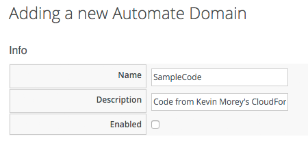
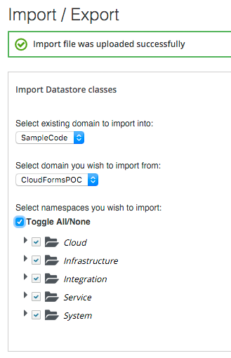
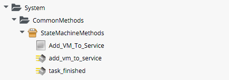
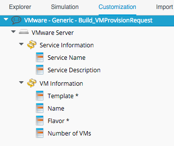

## Custom State Machines

There are times when an out-of-the-box Service Provision State Machine does not provide the flexibility that we need to create the service that we require. An example of this would be if we wish to offer our users the choice of how many VMs to provision when ordering from a Service Catalog, or to dynamically select the template to provision from.

When we create a new Service Catalog Item, we are presented with a drop-down list of Catalog Item Types to choose from:

If we pick any of the Cloud or Infrastructure Provider types, we are prompted to select a template or image to provision from, and we complete the dialog options to specify how we would like that VM provisioned. Once we save the new Catalog Item, these selections are "hard-coded" in an _MiqProvisionRequestTemplate_ object that contains the "request" options hash (containing `:number_of_vms` for example), and a `.source` association to the template to be provisioned from. We have no way of changing these when we order the service.

Fortunately there's a **Generic** Catalog Item Type that we can use to create a custom State Machine, and we can use this to assemble arguments for, and call, `$evm.execute('create_provision_request')` (see [Creating Provisoning Requests Programmatically](../chapter15/create_provision_request.md)). 

By hand-rolling the arguments to create\_provision\_request, we have complete control over the VM Provision Request. We can specify the template name or `:number_of_vms` dynamically at run-time if required.

### Importing an Example

Kevin Morey has created an example of such a State Machine in his excellent [CloudFormsPOC](https://github.com/ramrexx/CloudFormsPOC/wiki) code collection. We'll import this into a new `SampleCode` domain, and create our own Service Catalog Item from it.

#### Importing the Code

First we must create the new domain into which we can import the code. We won't enable this new domain as we'll copy any code that we want into our own domain:

After following Kevin's instructions on downloading and zipping the Automation code, we can import it from the **Automate -> Import / Export** menu:

Kevin has made quite a few enhancements, so we need to import some Methods and Instances from four different namespaces in the imported domain into our own domain. We'll be using a VMware provider for this example, so we'll copy the VMware-specific customisations.

From the `Infrastructure` namespace:

 
From the `Integration` namespace:

 
From the `Service` namespace:

 
From the `System` namespace:

#### Importing the Service Dialog

Now we'll import the **VMware - Generic - Build\_VMProvisionRequest** Service Dialog from Kevin's code collection. Go to **Automate -> Customization**, and to the **Import/Export** section in the accordion. Using **Choose File**, select `ServiceDialogs/VMware - Generic - Build_VMProvisionRequest.yml` from the expanded `CloudFormsPOC-master.zip`. Click **Upload**.

We're going to edit the Service Dialog to simplify it for our needs. Edit the dialog, and remove all but the following elements:
   

 
The **Template** element is dynamic. Ensure that its Entry Point is our newly imported `/Integration/VMware/DynamicDropDowns/List_VMware_Templates` Instance, and ensure that **Include Domain prefix in the path** is checked.

### Creating the Service Catalog Item

We'll create the new Service Catalog Item as we did before, but we'll pick **Generic** as the Catalog Item Type.

We enter a Name and Description, and check **Display in Catalog** to reveal the other options. We select a suitable Catalog, and the new **VMware - Generic - Build\_VMProvisionRequest** Dialog from the drop-downs.

Finally we select `/Service/Provisioning/StateMachines/ServiceProvision_Template/VMware_Build_VMProvisionRequest` from our Domain as the Provisioning Entry Point, and ensure that **Include Domain prefix in the path** is checked. Save the new Catalog Item.

### Ordering the Service

When we order the Service Catalog Item, we see that the Dialog has enumerated all templates on our Provider, and presents them to us as a drop-down list. We also get the option to select the number of VMs to provision:
   

We complete the dialog and click **Submit**, and after a while our new Service is ready:
   

Success!

 
