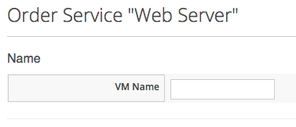
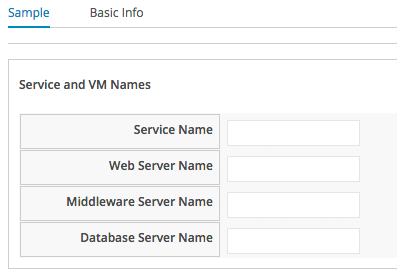
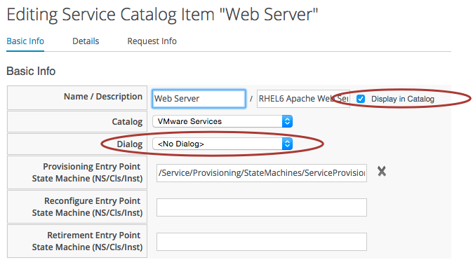
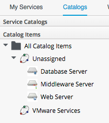
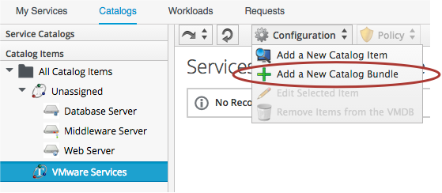
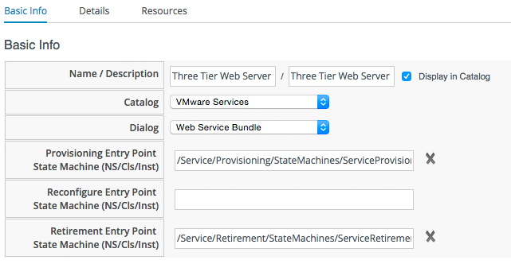
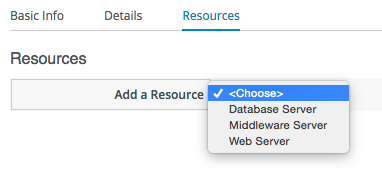
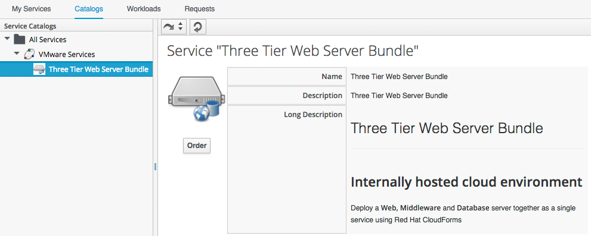

## Example - Creating a Service Catalog Bundle

We learnt in [Example - Creating a Service Catalog Item](creating_a_service_item.md) how to create Service Catalog Items that enable our users to provision fully-configured VMs from a single _Order_ button.

We can populate our Service Catalog with useful items, for example...
<br> <br>


<br>
In this example the VMs are provisioned from "fat" VMware templates, pre-configured with the application packages. The Service Dialog purely prompts for a VM Name...
<br> <br>




The next logical step on from this is to be able to provision several items together as a single _Service Catalog Bundle_.

### Creating the Service Dialog for the Bundle

When we create a Service Catalog Bundle, we handle the dialog input for each of the catalog items in a single Service Dialog that we create for the bundle. For our Web, Middleware and Database Server items, we must prompt for the VM name of each, but we'll also prompt for a service name...
<br> <br>



We name the dialog elements according to _sequence_ in which we want our individual items provisioned. Our sequence will be:

1. Database Server
2. Middleware Server
3. Web Server

Our four dialog elements are therefore constructed as...


The number in the element name reflects the sequence number, and the _CatalogItemInitialization_ and _CatalogBundleInitialization_ methods use this sequence number to pass the dialog value to the correct grandchild miq\_request\_task (see [The Service Provisioning State Machine](state_machine.md)).

Note that here we are explicitly setting just the _:vm\_target\_name_ key in the miq\_request\_task's options hash. We could alternatively have named our elements as _option\_{1,2,3}\_vm\_name_. The value _vm\_name_ is recognised and special-cased by CatalogItemInitialization, which sets both the _:vm\_target\_name_ and _:vm\_target\_hostname_ keys in the miq\_request\_task's options hash to the value input. The _:vm\_target\_name_ key sets the name of the resulting VM. The _:vm\_target\_hostname_ key can be used to input a Linux _hostname_ (i.e. FQDN) into a VMware Customization Specification, which can then set this in the VM using VMware Tools on firstboot.

### Preparing the Service Catalog Items

As we will be handling dialog input when the bundle is ordered, we need to edit each catalog item to remove the Dialog selection. We must also **untick** the _Display in Catalog_ option (this will remove the display of the Catalog and Dialog drop-downs, and the Entry Point selections)...
<br> <br>



Once we've done this, the Items will appear as _Unassigned_...
<br> <br>



### Creating the Service Catalog Bundle
Now we can go ahead and create our Catalog Bundle. Highlight the Catalog name, and select Configuration -> Add a New Catalog Bundle...
<br> <br>



Enter a Name and Description...


Tick the _Display in Catalog_ check-box to expose the remaining fields to be filled in... <br><br>



Select an appropriate Catalog, and the newly create bundle Dialog, from the appropriate drop-downs. 

For the Provisioning Entry Point, navigate to: _/ManageIQ/Service/Provisioning/StateMachines/ServiceProvision\_Template/CatalogBundleInitialization_. 

For this service we'll configure a Retirement Entry Point, so navigate to _/ManageIQ/Service/Retirement/StateMachines/ServiceRetirement/Default_.


Click on the _Details_ tab, and enter some HTML-formatted text to describe the Catalog Item to anyone viewing in the Catalog. 

```html
<h1>Three Tier Web Server Bundle</h1>  
<hr>  
<br>  
<h2>Internally hosted cloud environment</h2>  
<br>  
<p>Deploy a <strong>Web, Middleware</strong> and <strong>Database</strong> server together 
as a single service using Red Hat CloudForms</p>
```

Click on the _Resources_ tab, and select each of the unassigned catalog items to add them to the bundle...
<br><br>



Change the _Action Order_ and _Provisioning Order_ according to our desired sequence ('3' won't be visible until '2' is set for an option)...
<br><br>


Finally click the _Add_ button.

Select a suitable 100x100px icon for a Custom Image...


### Ordering the Catalog Bundle

Navigate to the _Service Catalogs_ section in the accordion, expand the _VMware Services_ Catalog, and highlight the _Three Tier Web Server Bundle_ Catalog Item
<br><br>



<br>
Click _Order_, and fill out the Service Dialog values...


Click _Submit_

After a new minutes, the new Service should be visible in _My Services_, containing the new VMs...
<br><br>


If we weren't watching the order that the VMs were created in, we could look in the database to check that our desired provisioning sequence was followed...

```
vmdb_production=# select id,name from vms order by id asc;
      id       |                     name
---------------+----------------------------------------------
...
 1000000000115 | new-project-db01
 1000000000116 | new-project-mid01
 1000000000117 | new-project-web01
```

Here we see that the VMs were created (and named) in the correct order.

### Provisioning into Multiple Providers

One of the cool features of Service Bundles is that we can mix and match catalog items that provision into different Providers. For example we may have a Bimodal infrastructure comprising RHEV for our traditional Mode 1 "Pet" workloads, and an in-house OpenStack private cloud for our Mode 2 "Cattle" workloads. Using CloudForms service bundles we could provision our relatively static database server into RHEV, and our dynamically scalable mid-tier and front-end servers into OpenStack.


