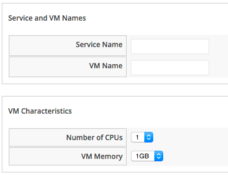
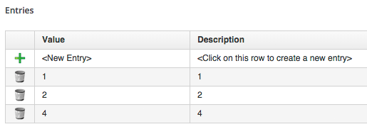
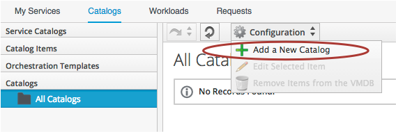
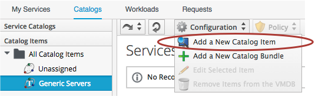
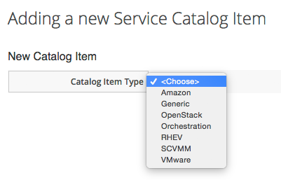
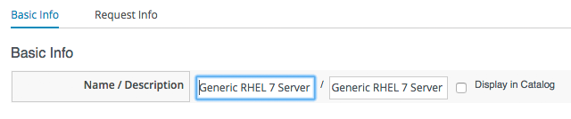
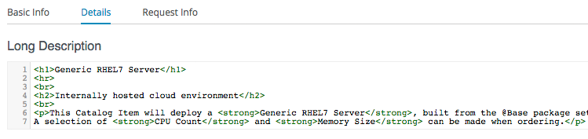
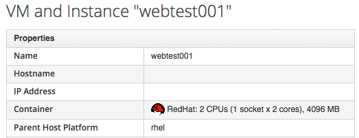

## Example - Creating a Service Catalog Item

In this section we'll create a Service Catalog Item to provision a VM into RHEV. We'll create a service dialog that allows the user to specify a name for both the new VM and the Service, and specify the number of CPUs and memory size of the provisioned VM from a drop-down list.

### The Service Dialog

#### Finding the Correct Element Names

When we create a service dialog, we need to think carefully what our various element names should be, so that the _CatalogItemInitialization_ State Machine successfully passes the values that we enter to their correct intended destination.

We saw from [Catalog{Item,Bundle}Initialization](catalogiteminitialization.md) that CatalogItemInitialization recognises and special-cases some element names, including _vm\_name_ and _service\_name_, and so we can create two of our elements with these names. If this is all we wish to prompt for, then we can move straight on to creating the service dialog.

For our use-case however, we are also prompting for number of CPUs, and memory size.
Any service dialog fields that we create with the intention of altering the final VM configuration (such as number of CPUs, or memory size), must also be named in a particular way. The element name must match the key in the provisioning task's options hash that we wish to overwrite.

We can find this key name in either of 2 ways; by examining the provisioning dialog yaml, or by performing an interactive provision of a VM, and then examining the provisioning task's options hash while the provisioning process is taking place.

##### Searching the Provisioning Dialog

The simplest way to search the provisioning dialogs is to copy the appropriate one, edit, then select and paste the contents to a flat file that can be grepped, i.e.

```
grep -i "memory\|cpu\|core\|socket" miq_provision_redhat_dialogs_template.yaml
      :number_of_sockets:
        :description: Number of Sockets
      :cores_per_socket:
        :description: Cores per Socket
      :vm_memory:
        :description: Memory (MB)
```

This shows that we probably need to name our elements _cores\_per\_socket_ and _vm\_memory_.

##### Examining the Options Hash During Provisioning

As an alternative (or confirmation) to finding the key names from the provisioning dialog, we can use one of the techniques that we learnt in [Investigative Debugging](../chapter11/investigative_debugging.md) to dump the contents of the provisioning task's options hash during a normal interactive provision. Here is an example of calling object\_walker after the _PostProvision_ stage in the VMProvision_VM/template State Machine...
<br><br>


<br><br>
Using the reader after we've provisioned a VM, we see that the same values are in the miq\_provision task's options hash...
<br><br>

```
~/object_walker_reader.rb | grep 'miq_provision' | grep "memory\|cpu\|core\|socket"
     |    object_walker:   $evm.root['miq_provision'].options[:cores_per_socket] = [1, "1"]   (type: Array)
     |    object_walker:   $evm.root['miq_provision'].options[:memory_reserve] = nil
     |    object_walker:   $evm.root['miq_provision'].options[:number_of_sockets] = [1, "1"]   (type: Array)
     |    object_walker:   $evm.root['miq_provision'].options[:vm_memory] = ["1024", "1024"]   (type: Array)
```

##### Some Commonly Used Element Names

The following table lists some commonly used element names for typical VM characteristics that can be modified from a service dialog...
<br><br>

|   VM Characteristic to be Modified   |   Element Name   |
|:--------------------:|:------------------:|
| VM Name | vm\_name |
| Number of CPUs | cores\_per\_socket &/or number\_of\_sockets |
| VM Memory | vm\_memory |
| Root Password | root\_password |
| MAC Address (first NIC) | mac\_address |
| IP Address (first NIC) | ip\_addr |
| OpenStack Flavor | instance\_type |

#### Creating the Service Dialog

We know from the investigation above that we must name our service dialog elements: _vm\_name_, _service\_name_, _option\_0\_cores\_per\_socket_ and _option\_0\_vm\_memory_.

We'll create our service dialog in the same way that we did in [A More Advanced Example](../chapter7/a_more_advanced_example.md), but this time we'll create two boxes _Service and VM Names_, and _VM Characteristics_, each containing two elements...
<br><br>



The _Service Name_ and _VM Name_ elements in the first box are both of type _Text Box_, and have the names _service\_name_ and _vm\_name_ respectively.

The _Number of CPUs_ element in the second box is of type _Drop Down List_...
<br><br>


with a list populated as follows...



The _VM Memory_ element in the second box is of type _Drop Down List_...


with a list populated as follows...


### Creating the Service Catalog Item

#### Create a Catalog

The first thing we should do is create a _Catalog_ to store the service item. We can have many catalogs; they are used to sort our service items and bundles logically.

Navigate to the Catalogs section in the accordion, and select Configuration -> Add a New Catalog
<br><br>



<br>
Give the Catalog a name, leave everything else as default, and click _Add_...
<br><br>


#### Create the Catalog Item

Navigate to the Catalog Items section in the accordion, highlight the newly created Catalog, then select Configuration -> Add a New Catalog Item
<br><br>



Select RHEV from the drop-down list...



Enter a Name and description...



Tick the _Display in Catalog_ check-box to expose the remaining fields to be filled in. Select our newly created _Generic Servers_ Catalog, and _Generic Service_ Dialog, in the appropriate drop-downs. For the Provisioning Entry Point, navigate to _/ManageIQ/Service/Provisioning/StateMachines/ServiceProvision\_Template/CatalogItemInitialization_
<br><br>


Click on the _Details_ tab, and enter some HTML-formatted text to describe the Catalog Item to anyone viewing in the Catalog




Click on the _Request Info_ tab, and fill in the details. Select an appropriate template, and Environment, Hardware, Network tab settings that are known to work when a VM is provisioned interactively (see [Tips and Tricks](tips_and_tricks.md)). The VM name will be overwritten during the provisioning process, but here we just set it as _changeme_.
<br><br>


Finally click the _Add_ button.

Select a suitable 100x110px ShadowMan icon for a Custom Image...


### Ordering the Catalog Item

Navigate to the _Service Catalogs_ section in the accordian, expand the _Generic Servers_ Catalog, and highlight the _Generic RHEL 7 Server_ Catalog Item
<br><br>


<br>
Click _Order_, and fill out the Service Dialog values...


Click _Submit_

After a new minutes, the new Service should be visible in _My Services_, containing the new VM...
<br><br>


<br>
If we examine the details of the VM, we see that it has been created with our requested CPU count and memory size...
<br><br>




