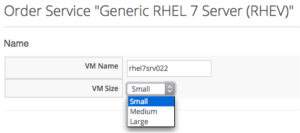
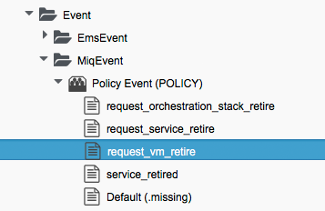
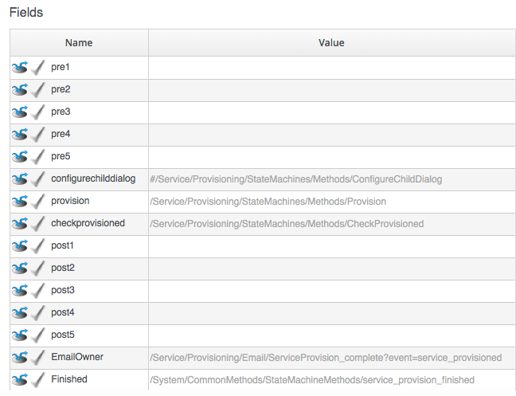
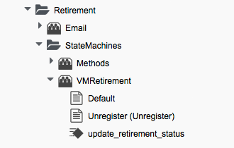
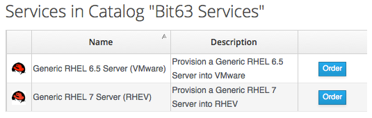
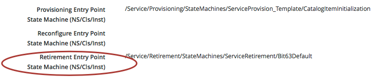
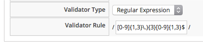
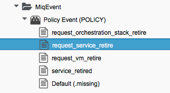
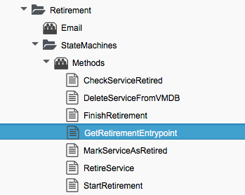

## Retirement
The Retirement process for VMs, Instances and Services was substantially re-written for ManageIQ _Botvinnik_ (CFME 5.4). This section describes the workflow in ManageIQ _Capablanca_ (CFME 5.5).

### VM and Instance Retirement

VM or Instance retirement is initiated from the Lifecycle menu on the VM details page:
<br> <br>



This raises a _request\_vm\_retire_ event that enters the Event Switchboard as an _MiqEvent/POLICY_ event:
<br> <br>


<br> <br>
...which redirects to a _Cloud_ or _Infrastructure_ (as appropriate) _/VM/Lifecycle/Retirement_ Instance:
<br> <br>


<br> <br>

The Lifecycle/Retirement Instance redirects us into the desired VM Retirement State Machine (_Default_ for Cloud Instances, _Default_ or _Unregister_ for Infrastructure VMs):
<br> <br>



#### Retirement-Related Attributes and Methods

A VM object has a number of retirement-related methods:

```  
$evm.root['vm'].start_retirement
$evm.root['vm'].finish_retirement
$evm.root['vm'].retire_now
$evm.root['vm'].retired?
$evm.root['vm'].retirement_state=
$evm.root['vm'].retirement_warn=
$evm.root['vm'].retires_on=
$evm.root['vm'].retiring?
```
and attributes:

```
$evm.root['vm'].retired = nil
$evm.root['vm'].retirement_last_warn = nil
$evm.root['vm'].retirement_requester = nil
$evm.root['vm'].retirement_state = nil
$evm.root['vm'].retirement_warn = nil
$evm.root['vm'].retires_on = nil
```
During the retirement process some of these are set to indicate progress:

```
$evm.root['vm'].retirement_requester = admin   (type: String)
$evm.root['vm'].retirement_state = retiring   (type: String)
```
and completion:
     
```     
$evm.root['vm'].retired = true   (type: TrueClass)
$evm.root['vm'].retirement_requester = nil
$evm.root['vm'].retirement_state = retired   (type: String)
$evm.root['vm'].retires_on = 2015-12-10   (type: Date)
```

#### VM Retirement State Machine

The VM Retirement State Machines(s) undo many of the operations performed by the VM Provisioning State Machine. They allow us to optionally deactivate a CI record from a CMDB, unregister from DHCP, Active Directory and DNS, and release both MAC and IP addresses.



##### StartRetirement

The **StartRetirement** Instance calls the _start\_retirement_ State Machine Method, which checks whether the VM is already in state 'retired' or 'retiring', and if so it aborts. If in neither of these states it calls the VM's _start\_retirement_ method, which sets the retirement_state attribute to 'retiring'.

##### PreRetirement / CheckPreRetirement

The State Machine allows us to have Provider-specific Instances and Methods for these stages, but the out-of-the-box **PreRetirement** Instance runs a vendor-independant _pre\_retirement_ Method that just powers off the VM. **CheckPreRetirement** checks that the power off has completed.

##### RemoveFromProvider / CheckRemovedFromProvider

The **RemoveFromProvider** stage allows us some flexibility in handling the actual removal of the VM, and this is where the _Default_ and _Unregister_ State Machines differ.

###### Default

The **RemoveFromProvider** stage of the _Default_ State Machine links to the _RemoveFromProvider_ Instance, which calls the _remove\_from\_provider_ State Machine Method, passing the argument ```removal_type => 'remove_from_disk'```. This checks whether the VM was provisioned from CloudForms / ManageIQ (vm.miq_provision is not _nil_), **or** if the VM is tagged with _lifecycle/retire\_full_. If either of these is true it fully deletes the VM from the underlying provider, including the disk image. Having done so it sets a boolean state variable _vm\_removed\_from\_provider_ to _true_.

If neither of these checks returns _true_, no action is performed.

###### Unregister

The **RemoveFromProvider** stage of the _Unregister_ State Machine links to the _UnregisterFromProvider_ Instance, which calls the _remove\_from\_provider_ State Machine Method, passing the argument ```removal_type => 'unregister'```. This checks whether the VM was provisioned from CloudForms / ManageIQ (vm.miq\_provision is not _nil_ ), **or** if the VM is tagged with _lifecycle/retire\_full_. If either of these is true it deletes the VM from the underlying provider, but retains the VM's disk image, allowing the VM to be re-created if required in the future. Having done so it sets a boolean state variable _vm\_removed\_from\_provider_ to _true_.

If neither of these checks is true, no action is performed.

##### FinishRetirement

The **FinishRetirement** Instance calls the _finish\_retirement_ State Machine Method that sets the following VM object attributes:

```
:retires_on => Date.today
:retired => true
:retirement_state => "retired"
```
It also raises a _vm\_retired_ event that can be caught by an Automate action or Control Policy.

##### DeleteFromVMDB

The **DeleteFromVMDB** Instance calls the _delete\_from\_vmdb_ State Machine Method, that checks for the state variable _vm\_removed\_from\_provider_, and if found (and true) it removes the VM record from the VMDB.


### Service Retirement

#### Defining a Service Retirement Entry Point

When we create a Service Catalog Item, we can optionally specify a Retirement Entry Point:



If we specify our own Retirement Entry Point, then this State Machine will be used to retire any services created from this Catalog Item, rather than the Default.

#### Retiring the Service

Service retirement is initiated from the Lifecycle menu on the Service details frame:
<br> <br>



This raises a _request\_service\_retire_ event that enters the Event Switchboard as an _MiqEvent/POLICY_ event:
<br> <br>


<br> <br>
which redirects to _/Service/Retirement/StateMachines/Methods/GetRetirementEntryPoint_:
<br> <br>


<br> <br>

This Instance runs a Method _get\_retirement\_entry\_point_ that returns the Retirement Entry Point defined when the Service Catalog Item was created. If this is empty then _/Service/Retirement/StateMachines/ServiceRetirement/Default_ is returned.

#### Retirement-Related Attributes and Methods

A Service object has a number of retirement-related methods:

```
$evm.root['service'].automate_retirement_entrypoint
$evm.root['service'].finish_retirement
$evm.root['service'].retire_now
$evm.root['service'].retire_service_resources
$evm.root['service'].retired?
$evm.root['service'].retirement_state=
$evm.root['service'].retirement_warn=
$evm.root['service'].retires_on=
$evm.root['service'].start_retirement
```
and attributes:

```
$evm.root['service'].retired = nil
$evm.root['service'].retirement_last_warn = nil
$evm.root['service'].retirement_requester = nil
$evm.root['service'].retirement_state = nil
$evm.root['service'].retirement_warn = nil
$evm.root['service'].retires_on = nil
```

#### Default Service Retirement State Machine

The Default Service Retirement State Machine is simpler than its VM counterpart:
 


##### StartRetirement

The **StartRetirement** Instance calls the _start\_retirement_ State Machine Method, which checks whether the Service is already in state 'retired' or 'retiring', and if so it aborts. If in neither of these states it calls the Service's _start\_retirement_ method, which sets the retirement_state attribute to 'retiring'.

##### RetireService / CheckServiceRetired

The **RetireService** Instance calls the _retire\_service_ State Machine Method, that in turn calls the Service object's _retire\_service\_resources_ method. This method calls the _retire\_now_ method of every VM comprising the Service, to initiate their retirement. **CheckServiceRetired** retries the stage until all VMs are retired or deleted.

##### FinishRetirement

The **FinishRetirement** stage sets the following Service object attributes:

```
:retires_on => Date.today
:retired => true
:retirement_state => "retired"
```
It also raises a _service\_retired_ event that can be caught by an Automate action or Control Policy.

##### DeleteServiceFromVMDB

The **DeleteServiceFromVMDB** Instance calls the _delete\_service\_from\_vmdb_ State Machine Method, which removes the Service record from the VMDB.