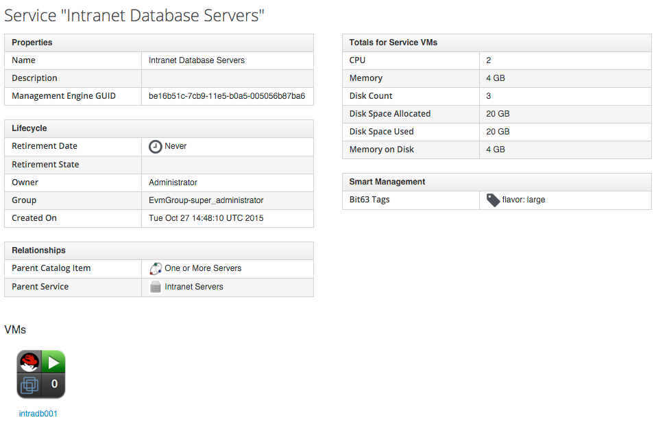
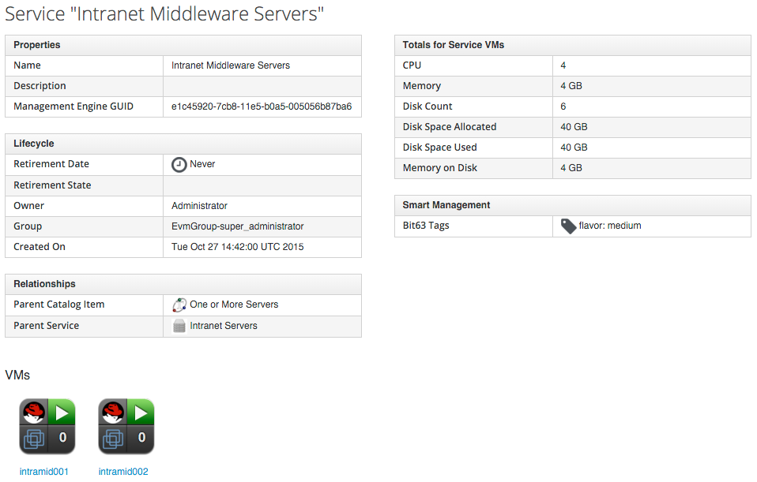
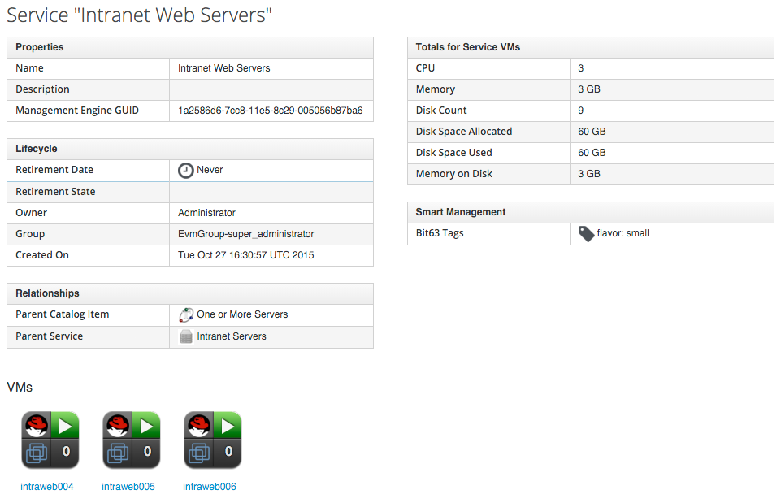
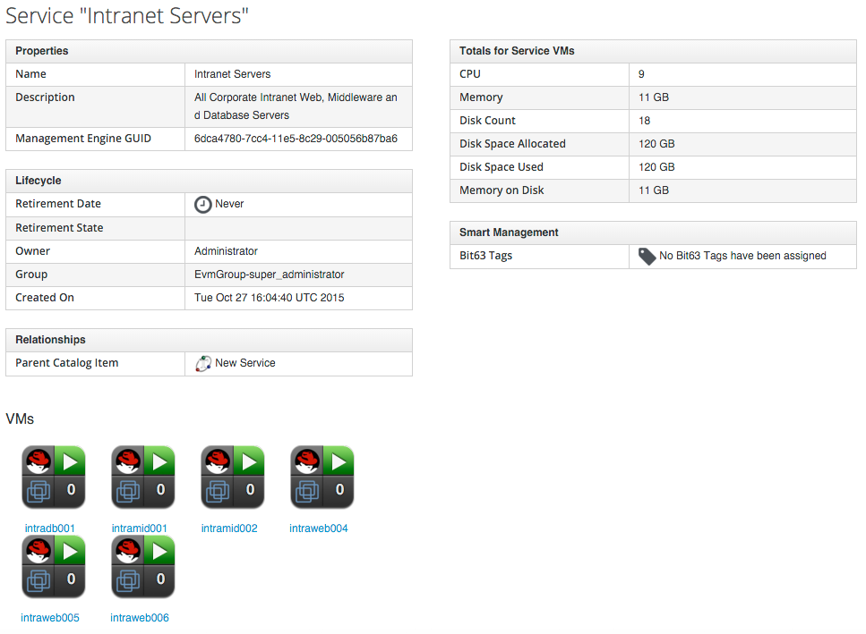

## Service Hierarchies

Services can be arranged in hierarchies for organisational and management convenience:
<br> <br>


<br> <br>
In this example we have three child Services, representing the three tiers of our simple intranet platform.

The Database Tier:


<br> <br>
The Middleware Tier:
<br> <br>

<br> <br>
The Web Tier:
<br> <br>

<br> <br>
When we view the parent Service, we see that it contains details of all child Services, including the cumulative CPU, Memory and Disk Counts:
<br> <br>


### Organising Our Services

To make maximum use of Service hierarchies, it is useful to be able to create empty Services, and to be able to move both Services and VMs into existing Services.

#### Creating An Empty Service

We could create a new Service directly from automation, using the lines:

```ruby
new_service = $evm.vmdb('service').create(:name => "My New Service")
new_service.display = true
```

For this example though, we'll create our new empty Service from a Service Catalog. 

##### State Machine

First we create a new Instance of the _/Service/Provisioning/StateMachines/ServiceProvision\_Template_ Class, but we comment out most entries:


<br> <br>
We'll call this Instance _EmptyService_.

##### Method

The _pre5_ stage of this State Machine is a Relationship to an Instance/Method containing the following code:

```ruby
begin
  service_template_provision_task = $evm.root['service_template_provision_task']
  service = service_template_provision_task.destination
  dialog_options = service_template_provision_task.dialog_options
  if dialog_options.has_key? 'dialog_service_name'
    service.name = "#{dialog_options['dialog_service_name']}"
  end
  if dialog_options.has_key? 'dialog_service_description'
    service.description = "#{dialog_options['dialog_service_description']}"
  end

  $evm.root['ae_result'] = 'ok'
  exit MIQ_OK
rescue => err
  $evm.log(:error, "[#{err}]\n#{err.backtrace.join("\n")}")
  $evm.root['ae_result'] = 'error'
  $evm.root['ae_reason'] = "Error: #{err.message}"
  exit MIQ_ERROR
end
```
The full script is available [here](https://github.com/pemcg/cloudforms-automation-howto-guide/blob/master/chapter18/scripts/rename_service.rb)

##### Service Dialog

We create a simple Service Dialog with element names _service\_name_ and _service\_description_:


##### Putting It All Together

Finally we assemble all of these parts by creating a new Service Catalog called _General Services_, and a new Catalog Item of type _Generic_:


<br> <br>
We can order from this Service Catalog Item to create our new empty Services.

### Adding VMs and Services to Existing Services

We'll provide the ability to move both Services and VMs into existing Services, from a button:
<br> <br>

<br> <br>
The button will present a drop-down list of existing Services that we can add as a new parent Service:


#### Button
##### Service Dialog

We create a simple Service Dialog with dynamic drop-down element name _service_:


##### Dialog Element Method

The dynamic drop-down element in the Service Dialog calls a method _list\_services_. We only wish to display a Service in the drop-down list if the user has permissions to see it via their RBAC filter. We define methods to retrieve a user's RBAC filter array, and to check that a service has a tag that matches the filter:

```ruby
def get_current_group_rbac_array(user, rbac_array=[])
  unless user.current_group.filters.blank?
    user.current_group.filters['managed'].flatten.each do |filter|
      next unless /(?<category>\w*)\/(?<tag>\w*)$/i =~ filter
      rbac_array << {category=>tag}
    end
  end
  rbac_array
end
  
def service_visible?(rbac_array, service)
  rbac_array.each do |rbac_hash|
    rbac_hash.each {|category, tag| return false unless service.tagged_with?(category, tag)}
  end
  $evm.log(:info, "Service: #{service.name} is visible to this user")
  true
end
```

When we enumerate the Services, we check on visibility to the user before adding to the drop-down list:


```ruby
$evm.vmdb(:service).find(:all).each do |service|
  $evm.log(:info, "Found service: #{service.name}")
  if service_visible?(rbac_array, service)
    visible_services << service
  end
end
if visible_services.length > 0
  if visible_services.length > 1
    values_hash['!'] = '-- select from list --'
  end
  visible_services.each do |service|
    values_hash[service.id] = service.name
  end
else
  values_hash['!'] = 'No services are available'
end
```

The full script is available [here](https://github.com/pemcg/cloudforms-automation-howto-guide/blob/master/chapter18/scripts/list_services.rb)

##### Button Method

The main Instance/Method called from the button adds the current VM or Service, into the Service selected from the drop-down list. We wish to be able to call this from a button on either a _Service_ object type, or a _VM and Instance_ object type. As before, we identify our context using ```$evm.root['vmdb_object_type']```. 

If we are adding a VM to an existing Service, we should allow for the fact that the VM might itself have been provisioned from a Service. We detect any existing Service membership, and if the old Service is empty after we move the VM, we delete the Service from the VMDB.

```ruby
begin
  parent_service_id = $evm.root['dialog_service']
  parent_service = $evm.vmdb('service').find_by_id(parent_service_id)
  if parent_service.nil?
    $evm.log(:error, "Can't find service with ID: #{parent_service_id}")
    exit MIQ_ERROR
  else
    case $evm.root['vmdb_object_type']
    when 'service'
      $evm.log(:info, "Adding Service #{$evm.root['service'].name} to #{parent_service.name}")
      $evm.root['service'].parent_service = parent_service
    when 'vm'
      vm = $evm.root['vm']
      #
      # See if the VM is already part of a service
      #
      unless vm.service.nil?
        old_service = vm.service
        vm.remove_from_service
        if old_service.v_total_vms.zero?
          old_service.remove_from_vmdb
        end
      end
      $evm.log(:info, "Adding VM #{vm.name} to #{parent_service.name}")
      vm.add_to_service(parent_service)
    end
  end
  exit MIQ_OK
rescue => err
  $evm.log(:error, "[#{err}]\n#{err.backtrace.join("\n")}")
  exit MIQ_ERROR
end
```

The full script is available [here](https://github.com/pemcg/cloudforms-automation-howto-guide/blob/master/chapter18/scripts/add_to_service.rb)

##### Putting It All Together

Finally we create two _Add to Service_ buttons, one on a _Service_ object type, and one on a _VM and Instance_ object type. We can go ahead and organise our Service hierarchies.

<hr>
_Exercise_: filter the list of services presented in the drop-down to remove the _current_ service - we would never wish to add a Service as its own parent.
