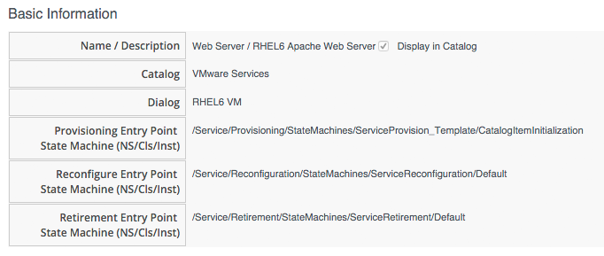
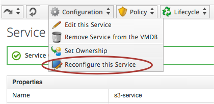
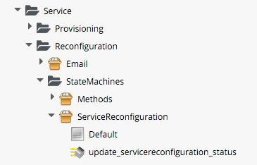
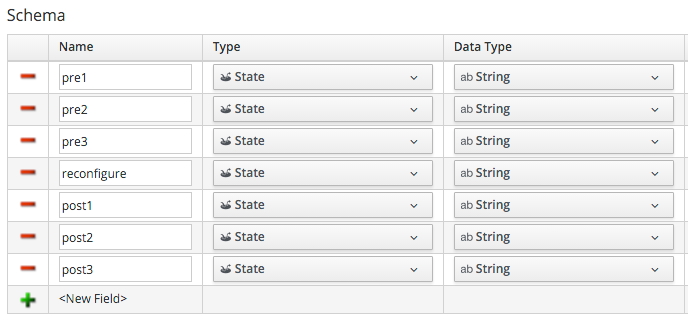
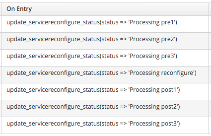
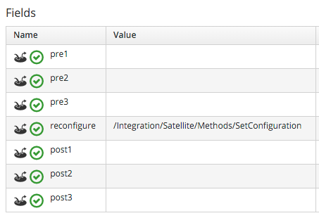

## Service Reconfiguration

So far when we have created our Service Catalog Items, we have specified a Provisioning Entry Point State Machine to handle the provisioning workflow for the new Service. There are two other Entry Points that we can optionally hook into, a Retirement Entry Point (see [Retirement](../chapter19/retirement.md)), and a Reconfigure Entry Point.



If we create a Service Catalog Item to have a Reconfigure Entry Point State Machine, then any Service created from that Catalog Item will have a _Reconfigure this Service_ option available under its _Configuration_ menu:
<br> <br>



If we select this option, we are presented with the original Service Dialog once more. Entering new values and clicking the _Submit_ button will create a _ServiceReconfigureRequest_ to peform the reconfiguration action, based on the revised values that we have have entered into the dialog.

This duel-use of an initial configuration dialog as a reconfiguration dialog, works well if we are using a configuration management tool such as Foreman (or Satellite 6), and Puppet. In this case we can specify Puppet  _Smart Class Parameters_ in our Service Dialog that can be passed to Foreman and used as overrides to static Smart Class Parameters.

### Wiring it all Together

Even though a Service Reconfiguration capability is provided for us by CloudForms/ManageIQ, we still need to do quite a bit of work if we wish to use it.

#### Creating the Namespaces and State Machines

In our own Domain, we'll create a _/Service/Reconfiguration/StateMachines_ Namespace:
<br> <br>



 We'll create a simple State Machine Class called _ServiceReconfigure_, with 7 state/stages:



pre{1-3} and post{1-3} are future-proofing placeholders in case we wish to enhance the functionality in future. For now we'll just be using the _reconfigure_ state/stage.

We'll clone /Service/Provisioning/StateMachines/ServiceProvision\_Template/update\_serviceprovision\_status from the _ManageIQ_ Domain into ours, and rename it to _update\_servicereconfiguration\_status_. We change line 6 from:

```prov = $evm.root['service_template_provision_task']```

to:

```reconfigure_task = $evm.root['service_reconfigure_task']```

<br>
We'll edit the _On Entry_, _On Exit_ and _On Error_ columns in the State Machine Class Schema to refer to the new _update\_servicereconfiguration\_status_ Method:
<br> <br>



We'll create a _Default_ Instance of the _ServiceReconfiguration_ State Machine Class, with the following Value fields:



