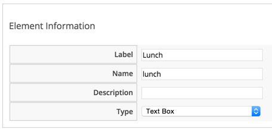
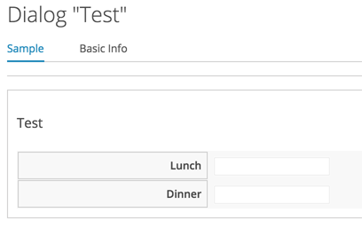
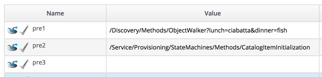
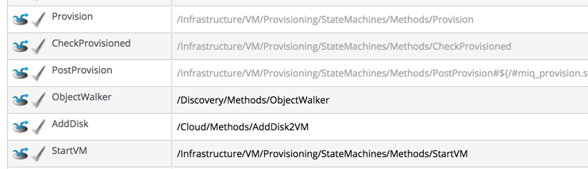
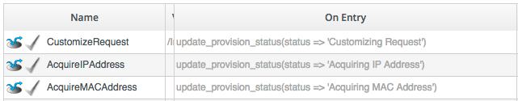
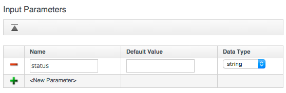

## Argument Passing and Handling


The way that we pass arguments into automation methods - and receive them from inside the method - varies depending on how we're calling the automation method. We need to consider this if we're writing a method that can be called in several ways, such as from a button and/or from an API call.

Here is an example of calling the same Instance (ObjectWalker) five ways, passing two arguments each time, 'lunch' and 'dinner'. We can use object\_walker\_reader to show us where the arguments can be read from inside our called method.

### Case 1 -  Calling from a Button

For this first case we call ObjectWalker (via /System/Process/Request/Call_Instance) from a button. We create a button dialog that prompts for two text box fields...


<br><br>


...and then add the button to a button group anywhere.

If we click on the button, and enter the values 'salad' and 'pasta' into the dialog boxes, we see the dialog values appear in $evm.root in the receiving method, indexed by the key name prefixed by _dialog\__

```
~/object_walker_reader.rb | grep -P "lunch|dinner"
    object_walker:  $evm.root['dialog_dinner'] = salad  (type: String)
    object_walker:  $evm.root['dialog_lunch'] = pasta  (type: String)
```

### Case 2 - Calling from the RESTful API

For this use-case we have a Ruby script that calls our internal CloudForms method via the REST API...
<br> <br>


```ruby
url = "https://#{server}"

post_params = {
  :version => '1.1',
  :uri_parts => {
    :namespace => 'Bit63/Discovery',
    :class => 'Methods',
    :instance => 'ObjectWalker'
  },
  :parameters => {
    :lunch => "sandwich",
    :dinner => "steak"
  },
  :requester => {
    :auto_approve => true
  }
}.to_json
query = "/api/automation_requests"

rest_return = RestClient::Request.execute(method: :post, url: url + query, :user => username, \
              :password => password, :headers => {:accept => :json}, :payload => post_params, verify_ssl: false)
result = JSON.parse(rest_return)
```
<br>
In the called method we see the arguments visible in several places; in the task's options hash as the _attrs_ key; under $evm.root because this is the Instance that we launched when entering automation, and under $evm.object because this is also our current object.

```
~/object_walker_reader.rb | grep -P "lunch|dinner"
    |    object_walker:  $evm.root['automation_task'].options[:attrs] = {:lunch=>"sandwich", :dinner=>"steak", :userid=>"admin"}  (type: Hash)
    object_walker:  $evm.root['dinner'] = steak  (type: String)
    object_walker:  $evm.root['lunch'] = sandwich  (type: String)
    object_walker:  $evm.object['dinner'] = steak  (type: String)
    object_walker:  $evm.object['lunch'] = sandwich  (type: String)
```

### Case 3 - Calling from $evm.instantiate

For this use-case we call ObjectWalker from another running automation method using $evm.instantiate
<br> <br>

```ruby
$evm.instantiate("Discovery/Methods/ObjectWalker?lunch=salad&dinner=spaghetti")
```
<br>
When called in this way, the called method only receives the arguments from $evm.object (one of our (grand)parent instances is $evm.root, our immediate caller is $evm.parent)...

```
~/object_walker_reader.rb | grep -P "lunch|dinner"
     object_walker:   $evm.object['dinner'] = spaghetti   (type: String)
     object_walker:   $evm.object['lunch'] = salad   (type: String)
```


### Case 4 - Calling from a Stage in a State Machine

Here we've cloned the _CatalogItemInitialization_ instance of the ServiceProvision\_Template State Machine into our own domain, and edited it to call ObjectWalker from the 'pre1' stage.
<br><br>



<br>
If we provision a new service, we can again retrieve the arguments in our called method from $evm.object...

```
~/object_walker_reader.rb | grep -P "lunch|dinner"
     object_walker:   $evm.object['dinner'] = fish   (type: String)
     object_walker:   $evm.object['lunch'] = ciabatta   (type: String)
```

### Case 5 - Passing Arguments via the ws_values Hash During a VM Provision

We can pass our own custom values into the VM provisioning process so that they can be interpreted by any method in the Provision VM from Template State Machine.

The facility to do this is provided by the additional\_values field in an /api/provision_requests REST call (additionalValues in the original SOAP EVMProvisionRequestEx call), or from the sixth element in the argument list to an $evm.execute('create\_provision\_request',...) call (see also [Creating Provisioning Requests Programmatically](../chapter17.create_provision_request.md)).

For this use case we've edited the Provision VM from Template State Machine to add a few extra stages:
<br><br>


<br><br>
These stages could modify the provisioning process if required based on the custom values passed in. An example of this might be to specify the disk size for an additional disk to be added by the AddDisk stage.

For this example we're using a simple automation method to call $evm.execute('create\_provision\_request',...) to provision a new VM. We specify the custom values in arg6:
<br><br>

```ruby
# arg1 = version
args = ['1.1']

# arg2 = templateFields
args << "name=rhel7-generic|request_type=template"

# arg3 = vmFields
args << "vm_name=test10|vlan=rhevm"

# arg4 = requester
args << "owner_email=pemcg@redhat.com|owner_first_name=Peter|owner_last_name=McGowan"

# arg5 = tags
args << nil

# arg6 = Web Service Values (ws_values)
args << "lunch=soup|dinner=chicken"

# arg7 = emsCustomAttributes
args << nil

# arg8 = miqCustomAttributes
args << nil

request_id = $evm.execute('create_provision_request', *args)
```
<br>
When we call this method and the VM provisioning process begins, we can retrieve the custom values at any stage from the miq_provision options hash using the _ws\_values_ key...

```
~/object_walker_reader.rb | grep -P "lunch|dinner"
object_walker:   $evm.root['miq_provision'].options[:ws_values] = {:lunch=>"soup", :dinner=>"chicken"}   (type: Hash)
```

### Finding Out How We've Been Called

We can use the $evm.root['vmdb\_object\_type'] value to find out how our method has been called, and retrieve the arguments in the appropriate manner, i.e.

```ruby
case $evm.root['vmdb_object_type']
  when 'miq_provision'
   # called from a VM Provision, retrieve from $evm.root['miq_provision'].options[:ws_values]
  when 'vm'
    # called from a button on a VM object, retrieve from $evm.object
  when 'automation_task'
  # Called from an API call, retrieve from $evm.root
end
```
### Passing Arguments When Calling a Method in the Same Class

When an Instance (such as a State Machine) calls a method in the same Class as itself, it can pass key/value argument pairs in parentheses as input parameters with the call. We see the VMProvision\_VM State Machine do this when it calls update\_provision\_status...
<br><br>


<br><br>

When we create a Method that accepts input parameters in this way, we need to specify the name and data type of each parameter in the Method definition...
<br><br>


<br><br>
The Method then reads the parameters from $evm.inputs...

```ruby
update_provision_status(status => 'pre1',status_state => 'on_entry')

 # Get status from input field status
 status = $evm.inputs['status']

 # Get status_state ['on_entry', 'on_exit', 'on_error'] from input field
 status_state = $evm.inputs['status_state']
```
