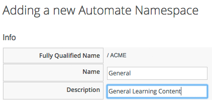
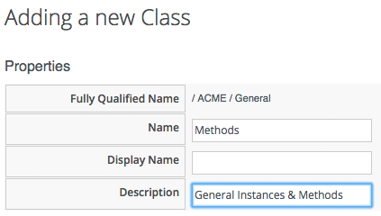

##Creating the Class

Before we create our first Automation script, we need to put some things in place. We'll begin by creating a new Domain called _ACME_.

In the Automation Explorer, highlight the **Datastore** icon in the side bar, and click **Configuration -> Add a New Domain**:
   

 
We'll give the Domain the name _ACME_, and ensure the **Enabled** checkbox is ticked:
   

 
Now we'll add a Namespace into this domain, called _General_. Highlight the _ACME_ Domain icon in the side bar, and click **Configuration -> Add a New Namespace**:
   

 
Give the Namespace the name _General_:
   

 
Now we'll create a new Class, called _Methods_. (it may seem that naming a class _Methods_ is somewhat confusing, however many of the generic Classes in the `ManageIQ` and `RedHat` Domains in the automation datastore are called `Methods` to signify their general-purpose nature).

Highlight the _General_ Domain icon in the side bar, and click **Configuration -> Add a New Class*:
   

 
Give the Class the name _Methods_:
   

 
We'll leave the _Display Name_ blank for this example.

We'll create a simple Schema. Click the **Schema** tab for the _Methods_ class, and click **Configuration -> Edit selected Schema**:
   

 
Click **New Field**, and add a single field with name _execute_, **Type** _Method_ and **Data Type** _String_:
   

 
Click the **tick** in the left hand column to save the field entry, and click the **Save** button to save the Schema.
   

 
We now have our generic Class defininition called `Methods` setup, with a simple Schema that executes a single Method.

