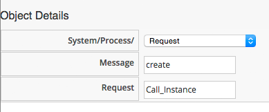
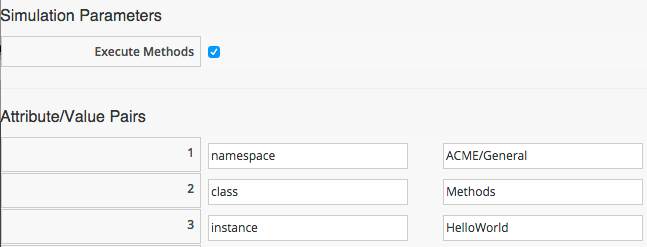

## Hello, World!

Our first Automation method is very simple, we'll write an entry to the `automation.log` file.

First we need to create an instance from our class. In the **Instances** tab of the new **Methods** Class, select **Configuration -> Add a New Instance**:
<br> <br>


<br>
We'll call the Instance _HelloWorld_, and it'll run (execute) a Method _hello\_world_:
<br> <br>


<br>Click the **Add** button.

In the **Methods** tab of the new `Methods` Class, select **Configuration -> Add a New Method**:
<br> <br>


<br>
Name the Method _hello\_world_, and paste the following code into the **Data** window:

```ruby
$evm.log(:info, "Hello, World!")
exit MIQ_OK
```
<br>


Click the **Validate** button, and then the **Add** button.

### Running the Instance

We'll run our new instance using the _Simulation_ functionality of Automation, but before that, ssh into the CloudForms appliance as _root_, and tail the `automation.log` file:

```
[root@cloudforms ~]# tail -f /var/www/miq/vmdb/log/automation.log
```

In the simulation we actually run an Instance called `Call_Instance` in the `/System/Request/` namespace of the `ManageIQ` domain, and this in turn calls our Instance using the _namespace_, _class_ and _instance_ attribute/value pairs that we pass to it (see [Ways of Entering Automation](../chapter10/ways_of_entering_automation.md)).

From the **Automation -> Simulation** menu, complete the details in the **Options** sidebar as shown:
<br> <br>




(Leave the Object Attribute Type as _None_)
<br> <br>



<br>
... then click **Submit**

If all went well, we should see our "Hello, World!" message appear in the automation.log file.


```
...INFO -- : Invoking [inline] method [/ACME/General/Methods/hello_world] with inputs [{}]
...INFO -- : <AEMethod [/ACME/General/Methods/hello_world]> Starting
...INFO -- : <AEMethod hello_world> Hello, World!
...INFO -- : <AEMethod [/ACME/General/Methods/hello_world]> Ending
...INFO -- : Method exited with rc=MIQ_OK
```
Success!
