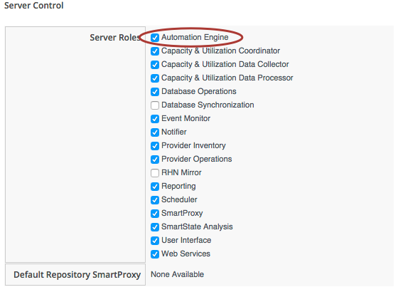

## Writing & Running Our Own Automation Scripts

Let's jump right in and start writing our first automation scripts. Before we do anything we need to ensure that the _Automation Engine_ server role is ticked on one of the appliances in our CloudForms/ManageIQ Zone (many Automation actions are Zone-specific, so we may need to enable the role in several Zones). We do this from the _Configure -> Configuration_ menu, selecting one of the CloudForms/ManageIQ Servers in the _Settings_ accordion.
   

Note: Setting the _Automation Engine_ role is necessary to be able to run _queued_ automation tasks (this includes anything that starts off as an Automation _Request_, which we'll cover later). Automation actions initiated directly from the WebUI - such as running Instances from Simulation, or processing methods to populate dynamic dialogs - are run on the UI appliance itself, regardless of whether it has the _Automation Engine_ role enabled.

