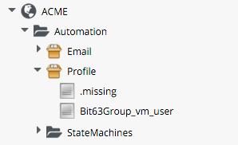
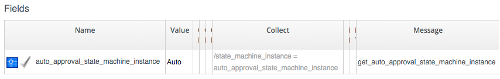
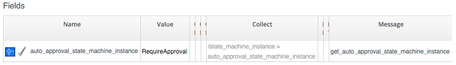
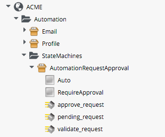
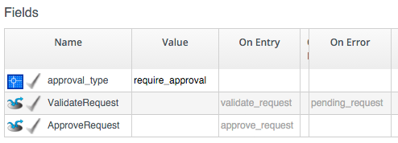
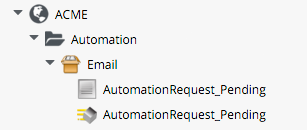
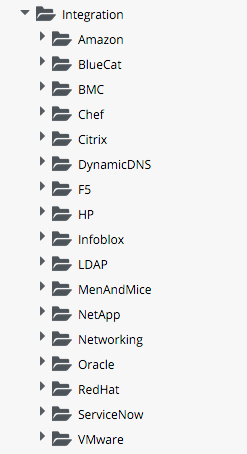
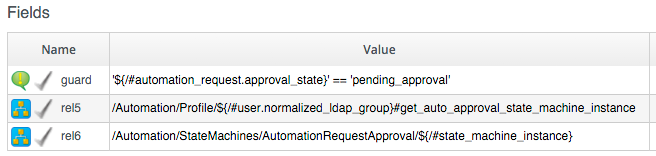
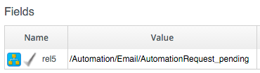

## Automation Request Approval

If we submit an automation request to the RESTful API using the credentials of an admin user (or equivalent), we can specify ```:auto_approve => true``` in the REST call and our request will be auto-approved and immediately executed. We usually don't want to embed admin credentials in our external (calling) scripts however, so how can we still get our automation requests auto-approved?

### Implementing an Approval Workflow for Automation Requests

We can implement our own approval workflow for automation requests. This example uses a group profile to control which groups can submit auto-approved automation requests.

#### Namespace

We'll create a new namespace called `Automation` under our Domain.

#### Group Profile

We create a simple variant of the VM Provisioning Group Profile:



The Profile merely contains the name of the Auto-Approval State Machine Instance that will be used to determine whether or not the request is auto-approved. The profile is queried using the message **get\_auto\_approval\_state\_machine\_instance**, and returns the _Value_ field via a _collect_ as **/state\_machine\_instance**.

We'll allow members of group _Bit63Group\_vm\_user_ to have their requests auto-approved, and everyone else (including Admins who haven't specified ```:auto_approve => true```) will require explicit approval.

The Profile for _Bit63Group\_vm\_user_ is:



The _.missing_ Profile for all other groups is:



#### State Machine

We'll create a `StateMachines` Namespace, and a simple variant of the VM `ProvisionRequestApproval` class:
<br> <br>



##### Instances

The `RequireApproval` Instance has an **approval\_type** value of _require\_approval_:



The `Auto` Instance is similar, but has an **approval\_type** value of _auto_.

##### Methods

The `validate_request` Method is as follows:

```ruby
request = $evm.root['miq_request']
resource = request.resource
raise "Automation Request not found" if request.nil? || resource.nil?

$evm.log("info", "Checking for auto_approval")
approval_type = $evm.object['approval_type'].downcase
if approval_type == 'auto'
  $evm.root["miq_request"].approve("admin", "Auto-Approved")
  $evm.root['ae_result'] = 'ok'
else
  msg =  "Request was not auto-approved"
  resource.set_message(msg)
  $evm.root['ae_result'] = 'error'
  $evm.object['reason'] = msg
end
```
The `pending_request` Method is as follows:

```ruby
#
# Description: This method is executed when the automation request is NOT auto-approved
#
# Get objects
msg = $evm.object['reason']
$evm.log('info', "#{msg}")

# Raise automation event: request_pending
$evm.root["miq_request"].pending
```

The Method definition is also given an input parameter with Input Name **reason** and Data Type **string**


The `approve_request` Method is as follows:

```ruby
#
# Description: This method is executed when the automation request is auto-approved
#
# Auto-Approve request
$evm.log("info", "AUTO-APPROVING automation request")
$evm.root["miq_request"].approve("admin", "Auto-Approved")
```
### Email Classes

We create an `Email` Class, with `AutomationRequest_Pending` Instance and Method:



The code is copied and adapted as appropriate from the VM _ProvisionRequest\_Pending_ Method. We specify as the **to\_email\_address** a user that will act as approver for the automation requests.

The full code for the Methods is [here](https://github.com/pemcg/cloudforms-automation-howto-guide/tree/master/chapter21/scripts)

### Policies

We need to generate Policy Instances for two AutomationRequest events, `AutomationRequest_created` and `AutomationRequest_approved`. We copy the standard `/System/Policy` Class to our Domain, and add two Instances:
<br> <br>



#### AutomationRequest_created

Our Policy Instance for `AutomationRequest_created` has three entries; an assertion and two relationships. We need to recognise whether an automation request was made with the `:auto_approve => true` parameter. If it was, we need to skip our own approval workflow.

We know (from some investigative debugging using `object_walker`) that when a request is made that specifies `:auto_approve => true`, we have an `$evm.root['automation_request'].approval_state` attribute with a value of **approved**. When a request is made that specifies `:auto_approve => false` this value is **pending\_approval**. We can therefore create our assertion to look for `$evm.root['automation_request'].approval_state == 'pending_approval'`, and only continue with the Instance if the boolean test returns **true**.

The **rel5** Relationship of this Instance performs a Profile lookup based on our user group, to find the Auto-Approval State Machine Instance that should be run.

The **rel6** Relationship calls this State Machine Instance:



#### AutomationRequest_pending

The `AutomationRequest_pending` Instance contains a single relationship to our `AutomationRequest_pending` Email Instance:



### Testing

We'll submit three automation requests via the RESTful API, calling a simple `Test` Instance. The calls will be made as follows:

- As user _admin_, specifying ```:auto_approve => true```
- As user _admin_, specifying ```:auto_approve => false```
- As a user who is a member of the group _Bit63Group\_vm\_user_
<br> <br>

For the first call, our assertion correctly prevents our custom approval workflow from running (the request has already been auto-approved). From `automation.log` we see:

```
Evaluating substituted assertion ["approved" == "pending_approval"]
Assertion Failed: <"approved" == "pending_approval">
Followed  Relationship [miqaedb:/System/Policy/AutomationRequest_created#create]
Followed  Relationship [miqaedb:/System/Policy/request_created#create]
Followed  Relationship [miqaedb:/System/Event/request_created#create]
```

For the second call we see that the assertion evaulates to **true**, but the user _admin_'s group (_EVMGroup-super\_administrator_) doesn't have a group profile. The `.missing` profile is used, and the automation requuest is not auto-approved.

The _admin_ user receives an email:

```
Request was not auto-approved.

Please review your Request and update or wait for approval from an Administrator.

To view this Request go to: https://192.168.1.245/miq_request/show/1000000000125

Thank you,
Virtualization Infrastructure Team
```
The _approving_ user also receives an email:

```
Approver, 
An automation request received from admin@bit63.com is pending.

Request was not auto-approved.

For more information you can go to: https://192.168.1.245/miq_request/show/1000000000125

Thank you,
Virtualization Infrastructure Team
```

Clicking the link takes us to an approval page, and we can approve the request, which then continues.

For the third call we see that the assertion evaluates to **true**, but this time we see the valid group profile being used:

```
Evaluating substituted assertion ["pending_approval" == "pending_approval"]
Following Relationship [miqaedb:/Automation/Profile/Bit63Group_vm_user#get_auto...
```

This group's profile auto-approves the automation request, and the `Test` instance is succesfully run:

```
Q-task_id([automation_task_1000000000186]) <AEMethod test> Calling the test method was successful!
```

Success!
