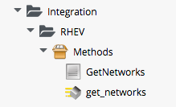

## Calling External Services

One of the powerful features of CloudForms/ManageIQ is _Integration_, or its ability to orchestrate and coordinate with external services as part of a workflow. There services might include a corporate IPAM solution, ticketing system, or a CMDB for example.

Kevin Morey's [CloudFormsPOC](https://github.com/ramrexx/CloudFormsPOC/wiki) code collection contains a useful set of sample Integration scripts that we can use and study.



We typically use SOAP or RESTful APIs to access theses external services, and there are several Ruby Gems that make this easy for us, including Savon (SOAP client), RestClient, XmlSimple and Nokogiri (XML parsers), and Fog (a Ruby Cloud Services Library).

### Calling a RESTful API Using the _RestClient_ Gem

We have already seen an example of using the _rest\_client_ gem in [Example - Customising VM Provisioning](../chapter15/customising_vm_provisioning.md). Here is another example, contributed to the _CloudFormsPOC_ Integration code by Carsten Clasohm, that creates a NetAPP volume using a REST call to NetApp's WFA (some lines have been omitted for brevity/clarity):


```ruby
require 'rest_client'
require 'nokogiri'

def call_netapp(action, ref=nil, body_type=:xml, body=nil)
  servername = $evm.object['servername']
  username = $evm.object['username']
  password = $evm.object.decrypt('password')
  url = "https://#{servername}/rest/workflows"+"#{ref}"

  params = {
    :method => action,
    :url => url,
    :verify_ssl => false,
    :user => username,
    :password => password,
    :headers => { :content_type => body_type, 
    			  :accept => :xml, 
    			  :authorization => "Basic #{password}" },
    :payload => body
  }
    
  response = nil
  begin
    response = RestClient::Request.new(params).execute
  rescue => e
    msg = "#{e}, #{e.response}"
    error("Error calling NetApp: #{msg}")
  end
  unless response.code == 200 || response.code == 201
    raise "Failure <- NetApp Response:<#{response.code}>"
  end
  results = Nokogiri::XML.parse(response)
  return results
end
...
body_xml = "<workflowInput><userInputValues>"
body_xml += "<userInputEntry key='ClusterName' value='#{primary_cluster_name}'/>"
body_xml += "<userInputEntry key='VserverName' value='#{primary_vserver_name}'/>"
body_xml += "<userInputEntry key='VolumeName' value='#{volume_name}'/>"
body_xml += "<userInputEntry key='VolumeSizeGB' value='#{volume_size}'/>"
body_xml += "<userInputEntry key='ExportPolicyName' value='#{export_policy_name}'/>"
unless mirror_cluster_name.blank?
  body_xml += "<userInputEntry key='SnapMirrorDestinationClusterName' value='#{mirror_cluster_name}'/>"
  body_xml += "<userInputEntry key='SnapMirrorDestinationVserverName' value='#{mirror_vserver_name}'/>"
  body_xml += "<userInputEntry key='SnapMirrorPolicy' value='DPDefault'/>"
end
body_xml += "</userInputValues></workflowInput>"

workflow_execute = call_netapp(:post, ref="/#{workflow_guid}/jobs", :xml, body=body_xml)
job_id = workflow_execute.xpath('/job/@jobId')[0].content
... 
```
  


### Calling a SOAP API Using the _Savon_ Gem

The following snippet is from the CloudFormsPOC Integration library, and shows an example of making a SOAP call to an f5 BIG-IP load balancer to add an IP address to a pool (some lines have been omitted for brevity/clarity):


```ruby
  def call_F5_Pool(soap_action, body_hash=nil)
    servername = nil || $evm.object['servername']
    username = nil || $evm.object['username']
    password = nil || $evm.object.decrypt('password')

    # require necessary gems
    require "rubygems"
    gem 'savon', '=2.3.3'
    require "savon"
    require 'httpi'

    # configure httpi gem to reduce verbose logging
    HTTPI.log_level = :info # changing the log level
    HTTPI.log       = false # diable HTTPI logging
    HTTPI.adapter   = :net_http # [:httpclient, :curb, :net_http]

    # configure savon gem
    soap = Savon.client do |s|
      s.wsdl "https://#{servername}/iControl/iControlPortal.cgi?WSDL=LocalLB.Pool"
      s.basic_auth [username, password]
      s.ssl_verify_mode :none
      s.endpoint "https://#{servername}/iControl/iControlPortal.cgi"
      s.namespace 'urn:iControl:LocalLB/Pool'
      s.env_namespace :soapenv
      s.namespace_identifier :pool
      s.raise_errors false
      s.convert_request_keys_to :none
      s.log_level :error
      s.log false
    end

    response = soap.call soap_action do |s|
      s.message body_hash unless body_hash.nil?
    end

    # Convert xml response to a hash
    return response.to_hash["#{soap_action}_response".to_sym][:return]
  end
  ...
  vm.ipaddresses.each do |vm_ipaddress|
    body_hash = {}
    body_hash[:pool_names] = {:item => [f5_pool]}
    body_hash[:members] = [{:items => 
    						{ :member => 
    						   {:address => vm_ipaddress, 
    						    :port => f5_port} 
    						 } 
    					   }]
    # call f5 and return a hash of pool names
    f5_return = call_F5_Pool(:add_member, body_hash)
  end
```

### Calling an OpenStack API using the _Fog_ Gem

The _fog_ gem is a multi-purpose cloud services library that supports connectivity to a number of cloud providers.

The follow code is an example of using the fog gem to retrieve OpenStack networks from Neutron, and present them as a dynamic drop-down dialog list. The code filters networks that match a tenant's name, and assumes that the CloudForms user has a _Tenant_ tag containing the same name:

```ruby
require 'fog'
begin
  tenant_name = $evm.root['user'].current_group.tags(:tenant).first
  $evm.log(:info, "Tenant name: #{tenant_name}")
  
  dialog_field = $evm.object
  dialog_field["sort_by"] = "value"
  dialog_field["data_type"] = "string"
  openstack_networks = {}
  openstack_networks[nil] = '< Select >'
  ems = $evm.vmdb('ems').find_by_name("OSP7 PackStack Core01")
  raise "ems not found" if ems.nil?
  
  neutron_service = Fog::Network.new({
    :provider => 'OpenStack',
    :openstack_api_key => ems.authentication_password,
    :openstack_username => ems.authentication_userid,
    :openstack_auth_url => "http://#{ems.hostname}:35357/v2.0/tokens",
    :openstack_tenant => tenant_name
  })
  
  keystone_service = Fog::Identity.new({
    :provider => 'OpenStack',
    :openstack_api_key => ems.authentication_password,
    :openstack_username => ems.authentication_userid,
    :openstack_auth_url => "http://#{ems.hostname}:35357/v2.0/tokens",
    :openstack_tenant => tenant_name
  })
  
  tenant_id = keystone_service.current_tenant["id"]
  $evm.log(:info, "Tenant ID: #{tenant_id}")
  networks = neutron_service.networks.all
  networks.each do |network|
    $evm.log(:info, "Found network #{network.inspect}")
    if network.tenant_id == tenant_id
      network_id = $evm.vmdb('CloudNetwork').find_by_ems_ref(network.id)
      openstack_networks[network_id] = network.name
    end
  end
  
  dialog_field["values"] = openstack_networks
  #
  #
  #
  $evm.log("info", "get_networks Method Ended")
  exit MIQ_OK
  
rescue => err
  $evm.log(:error, "[#{err}]\n#{err.backtrace.join("\n")}")
  exit MIQ_STOP
end 
```

### Reading from a MySQL Database Using the _Mysql_ Gem

The following code snippet shows an example of using the _mysql_ gem to connect to a MySQL-based CMDB, to extract project codes and create tags from them:

```ruby
require 'rubygems'
require 'mysql'

begin
  server = $evm.object['server']
  username = $evm.object['username']
  password = $evm.object.decrypt('password')
  database = $evm.object['database']
  
  con = Mysql.new(server, username, password, database)

  unless $evm.execute('category_exists?', "project_code")
    $evm.execute('category_create', :name => "project_code", 
       						        :single_value => true, 
       						        :description => "Project Code")
  end
  #
  # Force UTF_8 return
  #
  con.query('SET NAMES utf8')
  #
  # Retrieve the list of Project Codes from the CMDB
  #
  query_results = con.query('SELECT description,code FROM projectcodes')
  query_results.each do |record|
    tag_name = record[1]
    tag_display_name = record[0].force_encoding(Encoding::UTF_8)

    unless $evm.execute('tag_exists?', 'project_code', tag_name)
      $evm.execute('tag_create', "project_code", :name => tag_name, 
      								             :description => tag_display_name)
    end
  end
end
rescue Mysql::Error => e
  puts e.errno
  puts e.error
ensure
  con.close if con
end
```

These examples illustrate the tremendous flexibility that CloudForms/ManageIQ has to integrate with other Enterprise components. For example we can create State Machine based workflows that interface with help-desk ticketing systems, CMDBs, Corporate IPAM solutions, Enterprise Storage, Directory Services, configuration management systems, firewalls, or network load balancers.


