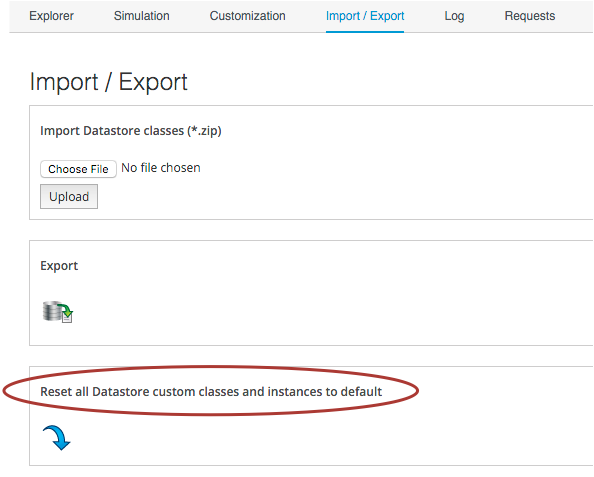

## Miscellaneous Tips

### Updating the Appliance

When a minor update to CloudForms Management Engine is released and installed (e.g. 5.4.1 -> 5.4.2), any changes to the Automate code are not automatically visible to the Automate Explorer. Go to Import / Export, and _Reset all Datastore custom classes and instances to default_ to get the updates added and visible.



### The ManageIQ Coding Style and Standards Guide

There is a ManageIQ Coding Style and Standards Guide [here](http://manageiq.org/documentation/development/coding_style_and_standards/), and a Ruby Style Guide [here](https://github.com/ManageIQ/ruby-style-guide). Although the guides don't specifically refer to Automation Coding style (it's more a guideline for ManageIQ code development), we can adopt the recommendations to keep our code clean and standards-compliant.

The guides recommend naming Instances in _CamelCase_ and Methods in snake_case, i.e.


### Defensive Programming

The dynamic nature of the object structure means that we have to be more careful about testing for _nil_ conditions, testing whether hash keys exist before we access them, test whether variables are enumerable before we call .each on them, etc.

Some examples are:

```ruby
if this_object.respond_to?(:attributes)
  if this_object.attributes.respond_to? :each
    this_object.attributes.each do |key, value|
      ...
```


```ruby
user = $evm.root['user'] rescue nil
unless user.nil?
  ...
```

```ruby
prov = $evm.root['miq_provision']
if prov.options.key?(:ws_values)
  ws_values = prov.options[:ws_values]
  ...
```

### Use an External IDE

The in-built WebUI code editor is fairly basic. It is often easier to develop in an external editor or IDE, and copy and paste code into the in-built editor when complete.


### Version Control

There isn't any (yet). Git integration for the Automation Datastore is planned for a future release of ManageIQ / CloudForms. In the meantime, use a separate Git repository, but this is a manual process unfortunately.
