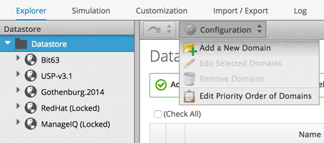
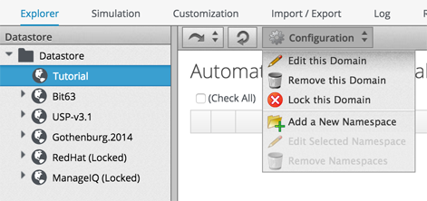
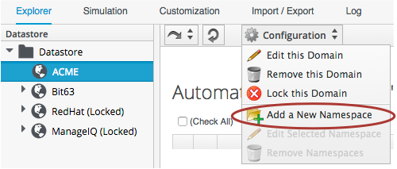
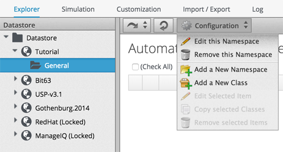
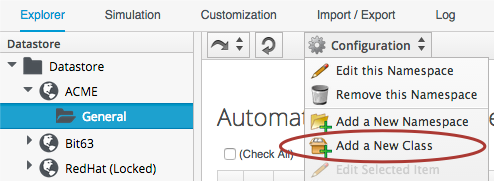
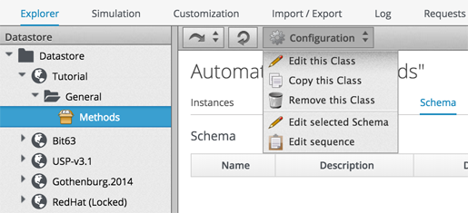
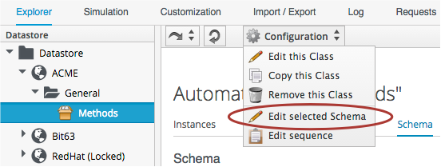

##Creating the Class

Before we create our first Automation script, we need to put some things in place. We'll begin by creating a new domain called _Tutorial_.

In the Automation Explorer, highlight the _Datastore_ icon in the side bar, and click _Configuration -> Add a New Domain_

Give the domain the name _Tutorial_...

Now we'll add a namespace into this domain, called _General_. Highlight the _Tutorial_ domain icon in the side bar, and click _Configuration -> Add a New Namespace_

Give the namespace the name _General_...

Now we'll create a new class, called _Methods_. Highlight the _General_ domain icon in the side bar, and click _Configuration -> Add a New Class_

Give the class the name _Methods_...

Each of the Domain, Namespace and Class definitions allows us to specify an optional _Description_ field, but for these examples we'll leave that blank.

We'll create a simple schema. Click the _schema_ tab for the _Methods_ class, and click _Edit selected Schema_

Click _New Field_, and add a single field with name _execute_, Type _Method_ and Data Type _String_. 

Click the tick in the left hand column to save the field entry, and click the _Save_ button to save the schema.

We now have our generic class defininition called _Methods_ setup, with a simple schema that executes a single method.

