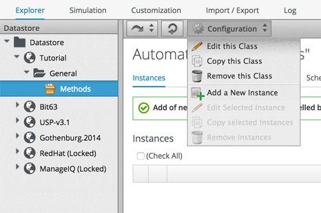
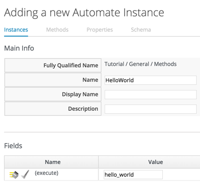
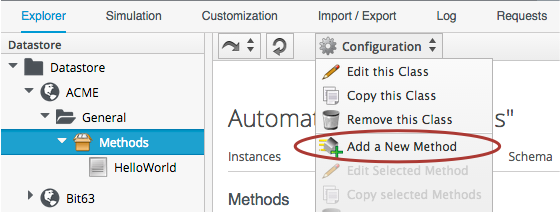
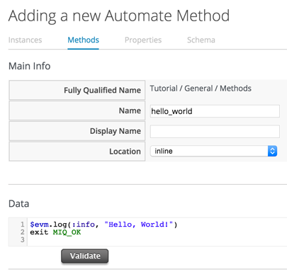
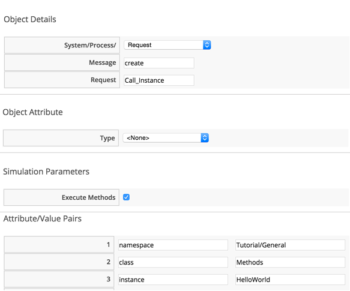
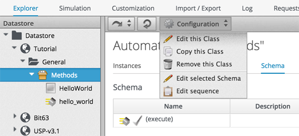

## Hello, World!

Our first Automation method is very simple, we'll write an entry to the _automation.log_ file.

First we need to create an instance from our class. In the _Instances_ tab of the new _Methods_ class, select _Configuration -> Add a New Instance_.
<br> <br>



<br>
We'll call the instance _HelloWorld_, and it'll run (execute) a method _hello\_world_
<br> <br>



<br>Click the _Add_ button.

In the _Methods_ tab of the new _Methods_ class, select _Configuration -> Add a New Method_.
<br> <br>



<br>
Name the method _hello\_world_, and paste the following code into the Data window:

```ruby
$evm.log(:info, "Hello, World!")
exit MIQ_OK
```
<br>



Click the _Validate_ button, and then the _Add_ button.

### Running the Instance

We'll run our new instance using the _Simulation_ functionality of Automation, but before that, ssh into the CloudForms appliance as _root_, and tail the automation.log file:

```
[root@cloudforms ~]# tail -f /var/www/miq/vmdb/log/automation.log
```

In the simulation we actually run an instance called _Call\_Instance_ in the _/System/Request/_ namespace of the _ManageIQ_ domain, and this in turn calls our instance using the _namespace_, _class_ and _instance_ attribute/value pairs that we pass to it (see section xxx for the different ways of entering automation).

From the _Automation -> Simulation_ menu, complete the details in the _Options_ sidebar as shown...
<br> <br>




(Leave the Object Attribute Type as _None_)
<br> <br>



<br>
... then click _Submit_

If all went well, we should see our "Hello, World!" message appear in the automation.log file.


```
...  INFO -- : Invoking [inline] method [/ACME/General/Methods/hello_world] with inputs [{}]
...  INFO -- : <AEMethod [/ACME/General/Methods/hello_world]> Starting
...  INFO -- : <AEMethod hello_world> Hello, World!
...  INFO -- : <AEMethod [/ACME/General/Methods/hello_world]> Ending
...  INFO -- : Method exited with rc=MIQ_OK
```
Success!
