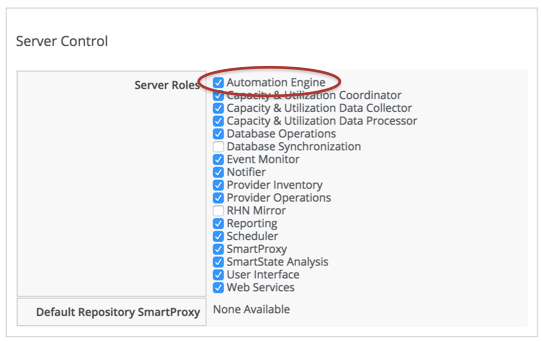

## Writing & Running Our Own Automation Scripts

Let's go ahead and start writing our first automation scripts. Before we do anything we need to ensure that the _Automation Engine_ server role is ticked on one of the appliances in our CloudForms Region. We do this from the _Configure -> Configuration_ menu, selecting one of the CloudForms Server in the _Settings_ accordion.

